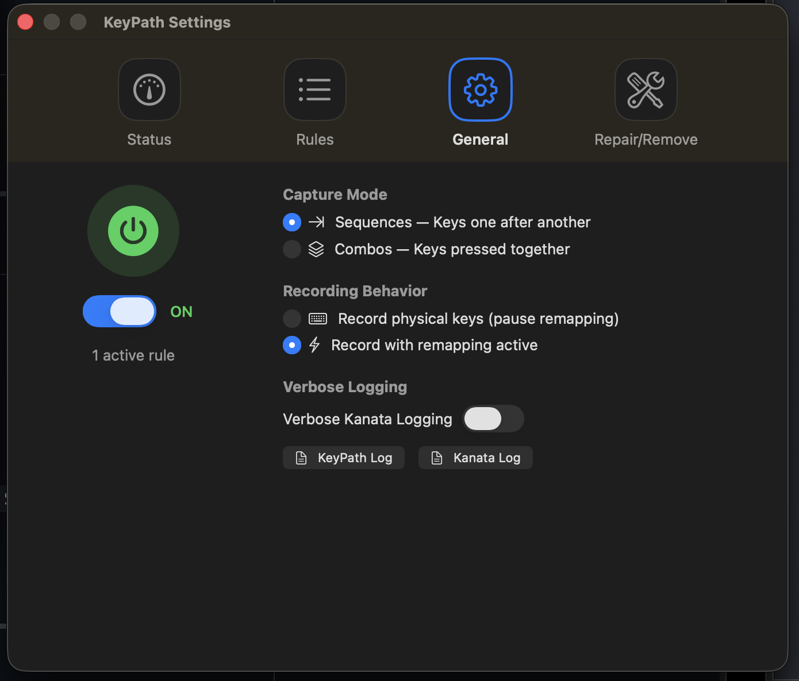
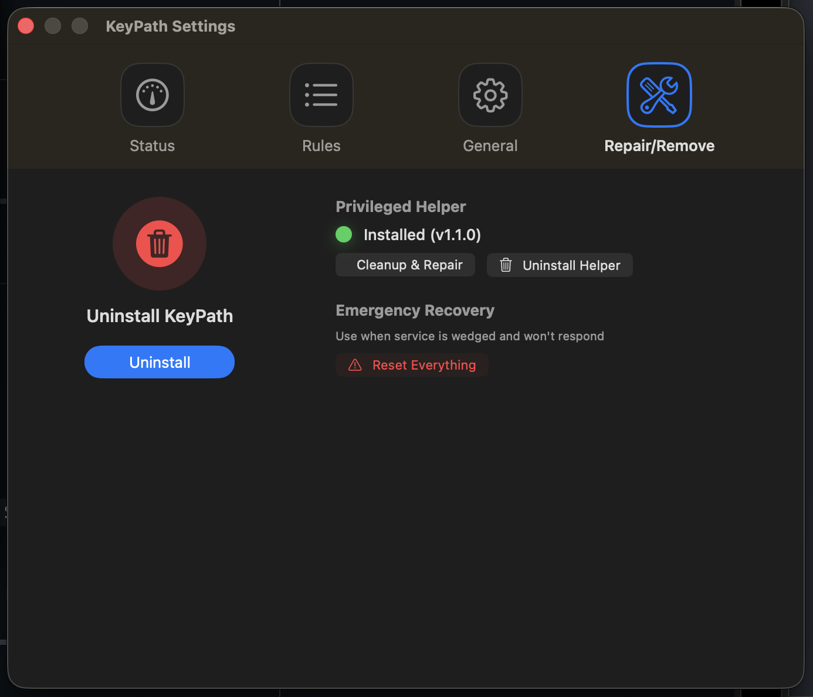

# KeyPath

<div align="center">
  

  **Remap any key on your Mac. No terminal required.**

  [](https://www.apple.com/macos/)
  [](LICENSE)
</div>

---

## What can KeyPath do?

**Turn any key into any other key.** A few examples:

| Want to... | KeyPath can do it |
|------------|-------------------|
| Make Caps Lock act as Escape | ✓ |
| Caps Lock = Escape when tapped, Control when held | ✓ |
| Double-tap Shift for Caps Lock | ✓ |
| Fix a broken key by remapping it | ✓ |
| Create custom modifier combinations | ✓ |

Changes apply instantly. No restart needed.

---

## Getting Started

1. **Download** from the [Releases page](https://github.com/malpern/KeyPath/releases)
2. **Open** KeyPath.app
3. **Follow** the setup wizard (grants permissions, installs driver)
4. **Create** your first rule and click Save

That's it. Your keyboard is now remapped.

<div align="center">
  
</div>

---

## Features

- **Visual rule editor** — No config files to write
- **Tap-hold keys** — One action when tapped, another when held
- **Tap-dance** — Different actions for single, double, or triple tap
- **Instant apply** — Changes work immediately
- **Emergency stop** — Press `Ctrl + Space + Esc` to disable everything
- **Works at boot** — Remappings active before you log in

---

## Requirements

- macOS 14.0 (Sonoma) or later
- Apple Silicon or Intel Mac

---

## Safety

KeyPath requires two permissions to work:
- **Input Monitoring** — to see your key presses
- **Accessibility** — to send the remapped keys

The setup wizard handles both automatically.

**Emergency stop:** If something goes wrong, press `Ctrl + Space + Esc` to instantly disable all remappings.

**Privacy:** KeyPath works entirely offline. No data collection, no telemetry.

---

## Settings

Open Settings with **Cmd+,** or click the gear icon.

<div align="center">
  
</div>

- **Status** — See system health at a glance. All green checkmarks means everything's working. Click "Launch Wizard" to fix any issues.

<div align="center">
  
</div>

- **Rules** — View and manage your custom rules. Toggle rules on/off, edit, or delete them.

<div align="center">
  
</div>

- **General** — Configure capture mode, recording behavior, and access logs for troubleshooting.

<div align="center">
  
</div>

- **Repair/Remove** — Cleanup & Repair fixes common issues. Reset Everything is for when the service is wedged.

---

## Uninstall

To completely remove KeyPath: **Settings → Repair/Remove → Uninstall**

---

## Background

KeyPath is a macOS frontend for [Kanata](https://github.com/jtroo/kanata), a powerful cross-platform keyboard remapping engine created by [jtroo](https://github.com/jtroo). Huge thanks to jtroo for building such a solid foundation and for being responsive to macOS-specific needs.

Using Kanata directly on macOS means dealing with driver installation, permission debugging, service management, and hand-written config files. KeyPath handles all of that so you can just remap your keys.

Built with Swift and SwiftUI. Uses [Karabiner VirtualHID Driver](https://github.com/pqrs-org/Karabiner-DriverKit-VirtualHIDDevice) for system-level key events.

---

## Contributing

```bash
git clone https://github.com/malpern/KeyPath.git
cd KeyPath
swift build && swift test
```

See [CONTRIBUTING.md](CONTRIBUTING.md) for more.

---

## License

KeyPath (the Swift application) is released under the **MIT License** — see [LICENSE](LICENSE)

KeyPath bundles [Kanata](https://github.com/jtroo/kanata), which is licensed under **LGPL-3.0**. See [THIRD_PARTY_LICENSES.md](THIRD_PARTY_LICENSES.md) for details.

---

<div align="center">
  <strong>Made with love for the macOS community</strong>

  <p>If KeyPath helps you, consider starring the repo!</p>

  <a href="https://github.com/malpern/KeyPath">GitHub</a> ・ <a href="https://x.com/malpern">@malpern</a>
</div>
