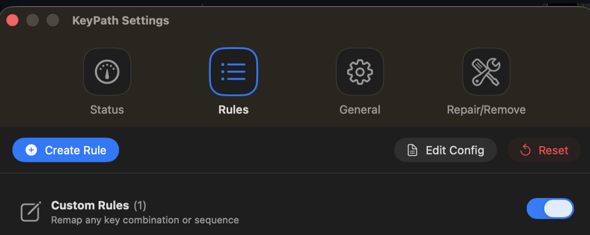

# KeyPath

<div align="center">
  

  **Powerful keyboard remapping for Mac—without the learning curve.**

  [](https://www.apple.com/macos/)
  [](LICENSE)
</div>

---

## Simple to Use

KeyPath lets you remap keys and create custom shortcuts **just by pressing them**. No config files to edit. No syntax to learn. No terminal commands. Just press the key you want to change, press what you want it to become, and you're done.

- **Press-to-record**: Click a field, press a key, done
- **Instant feedback**: Changes apply immediately—no restart, no save-and-wait
- **Visual rule editor**: See your remappings at a glance, toggle them on and off
- **Guided setup**: A wizard walks you through permissions and driver installation

<div align="center">
  
</div>

---

## Seriously Powerful

Under the hood, KeyPath is built on [**Kanata**](https://github.com/jtroo/kanata)—a keyboard remapping engine that's significantly more capable than tools like Karabiner-Elements or KMonad.

### What makes Kanata different?

| Capability | KeyPath (Kanata) | Karabiner-Elements |
|------------|------------------|-------------------|
| **True layers** | Keys change meaning based on active layer—compose layers, toggle them, or hold to activate | Profiles are global; layer-like behavior requires complex JSON rules |
| **Reliable tap-hold** | Multiple detection strategies (`tap-hold-press`, `tap-hold-release`, etc.) for different use cases | Basic tap-hold with less tuning options |
| **Composable conditions** | Combine timing, layer state, and key history into a single rule | Conditions are separate JSON objects, harder to compose |
| **Low latency** | Purpose-built for real-time input; runs as a system daemon | Also low-latency, but JSON parsing and rule matching can add overhead |

Karabiner-Elements is easier to start with if you want to write configs by hand—its JSON model is straightforward. But that simplicity comes at the cost of expressiveness. Kanata's architecture was designed from the ground up for advanced keyboard behaviors.

**KeyPath gives you Kanata's power through a visual interface.** You get the best of both worlds: firmware-level capability, zero config-file friction.

### Full Access to the Config File

KeyPath writes a standard Kanata configuration file on your behalf—but you're not locked in. Power users can open and edit the config directly by clicking **Edit Config** in the app, or via the terminal:

```
~/Library/Application Support/KeyPath/keypath.kbd
```

<div align="center">
  
</div>

Kanata's configuration language uses [S-expressions](https://en.wikipedia.org/wiki/S-expression) (Lisp-style syntax) and is remarkably expressive. It supports:

- **Variables and aliases** — DRY principle for complex configs
- **Conditional logic** — `switch`, `fork`, and template conditionals
- **Templates** — Reusable config patterns with parameter substitution
- **Macros** — Arbitrary key sequences with timing control
- **Sequences** — Vim-style leader key workflows
- **Input chords** — Press multiple keys simultaneously for a different action

<div align="center">
  
</div>

This isn't a toy DSL—it's a full configuration language that can express behaviors impossible in JSON-based tools. See the [Kanata configuration guide](https://github.com/jtroo/kanata/blob/main/docs/config.adoc) for the complete reference.

**The best part:** Start with KeyPath's UI, and graduate to hand-editing only when you want to. Your visual rules and manual edits coexist in the same file.

### Clear feedback when validation fails

If Kanata rejects a generated config, KeyPath now surfaces a dedicated modal that lists every error, offers a one-click copy button, and links directly to the on-disk config and diagnostics panel. No more guessing why a save failed—grab the exact kanata output, jump into your editor, or open System Status without leaving the app.

---

## Home Row Mods—Finally Reliable on Mac

**KeyPath is the only Mac tool that enables [Home Row Mods](https://precondition.github.io/home-row-mods) in pure software with reliability comparable to hardware firmware like QMK or ZMK.**

<div align="center">
  
</div>

### What are Home Row Mods?

Home Row Mods (HRM) turn the keys under your fingers—A, S, D, F and J, K, L, ;—into dual-function keys:

- **Tap** → types the letter (`a`, `s`, `d`, `f`)
- **Hold** → activates a modifier (`Ctrl`, `Alt`, `Cmd`, `Shift`)

This means you never have to move your hands from the home row to press modifiers. It's a game-changer for ergonomics, speed, and reducing repetitive strain.

### Why is this hard?

Getting HRM right requires *precise* tap-hold detection. If the timing is off, you get misfires—letters when you meant modifiers, or vice versa. Most software solutions fail at this because they lack the nuanced detection algorithms that mechanical keyboard firmware uses.

### Why Kanata succeeds where Karabiner-Elements struggles

Karabiner-Elements offers basic tap-hold via `to_if_alone` and `to_if_held_down`—a simple timeout threshold. This works for casual use but produces constant misfires during fast typing because it can't distinguish between "I'm holding this key to modify the next one" and "I'm just rolling through keys quickly."

Kanata implements **eight distinct tap-hold strategies**, each designed for different typing patterns:

| Strategy | Best for | How it works |
|----------|----------|--------------|
| `tap-hold-press` | Home row mods | Hold activates early when *any* other key is pressed |
| `tap-hold-release` | Permissive typing | Hold activates when another key is pressed *and released* |
| `tap-hold-tap-keys` | Fast typists | Specific keys always trigger tap, never early hold |
| `tap-hold-except-keys` | Fine-tuning | Certain keys bypass hold detection entirely |

**The key insight:** hold detection shouldn't be purely time-based. It should consider *what else you're doing*. If you press `F` (mapped to Shift) and then `J`, you probably want `Shift+J`. But if you press `F` then `G` then `H` in rapid succession, you're typing—not modifying.

### Why KeyPath + Kanata deliver reliable HRM

1. **Firmware-style state machine, not just timeouts.** Kanata’s tap-hold engine mirrors QMK/ZMK with strategies like `tap-hold-press`, `tap-hold-release`, and per-key exception lists. Karabiner (timeout-only) and Hammerspoon/kmod scripts lack that nuanced “hold when another key is pressed” logic, so they misfire under real typing speed.
2. **Layer-aware, canonical config output.** Kanata natively understands `layer-while-held`, momentary activators, and dual-role keys. HRM is expressed in the same language you’d use on a custom keyboard and survives regen/reload cycles; there’s no fragile JSON/Lua glue.
3. **Product UX built around HRM.** KeyPath exposes Kanata’s advanced tap-hold knobs (timings, per-key toggles, quick tap rules) through a dedicated editor and provides guardrails like the validation-failure modal. Karabiner/Hammerspoon give raw config access but no first-class HRM tooling, so every tweak is hand-edited and easy to break.

### Kanata vs. Karabiner-Elements vs. Hammerspoon

Kanata isn't trying to replace Karabiner or Hammerspoon for everything. For many general remaps those tools are great. But for HRM specifically, Kanata’s firmware-grade tap-hold engine is in a different league. Instead of bolting a timeout onto macOS key events, Kanata runs a dedicated state machine that understands simultaneous presses, layer activators, and per-key exceptions. KeyPath rides on top of that engine to give you a point-and-click UX. Here's how they compare:

| Capability | Kanata + KeyPath | Karabiner-Elements | Hammerspoon |
|------------|------------------|--------------------|-------------|
| Tap-hold strategies | Multiple built-ins (`tap-hold-press`, `tap-hold-release`, `tap-hold-tap-keys`, etc.) | Single timeout (`to_if_alone`, `to_if_held_down`) | Requires custom Lua logic |
| Early hold activation when another key is pressed | ✅ Native support | ❌ Timeout only | ⚠️ Possible but manual scripting |
| Per-key tap exceptions / bypass lists | ✅ (`tap-hold-tap-keys`, `tap-hold-except-keys`) | ❌ | ⚠️ Manual Lua |
| Layer-aware HRM (momentary layers, `layer-while-held`) | ✅ First-class concepts | ⚠️ Workarounds via complex JSON | ⚠️ DIY modal layer code |
| UI for tuning HRM (timings, per-key config) | ✅ KeyPath editor with live preview | ❌ JSON editing | ❌ Lua scripting |
| Reliability at high typing speed | ✅ Matches QMK/ZMK semantics | ❌ Frequent misfires due to timeout-only detection | ⚠️ Depends on custom code quality |
| Config readability | ✅ Kanata Lisp with comments + generated sections | ⚠️ Deep nested JSON | ⚠️ Arbitrary Lua |

In short, Kanata on macOS gives you the same HRM semantics you'd expect from firmware, without needing to flash a keyboard. Karabiner and Hammerspoon can approximate HRM, but they lack the nuanced state tracking needed to avoid misfires under real typing workloads.

### Where QMK/ZMK still go further

Hardware firmware such as QMK and ZMK still have headroom KeyPath hasn’t reached yet: bilateral combos, hold-per-finger heuristics, and highly customized priority rules (see [this QMK deep dive](https://www.reddit.com/r/ErgoMechKeyboards/comments/1f18d8h/i_have_fixed_home_row_mods_in_qmk_for_everyone/)). Those projects can coordinate across thumb clusters, read matrix-level timing, and run combo detection before the OS ever sees a key. KeyPath’s HRM is firmware-grade for most workflows, but if you want experimental combo models or split-keyboard-specific logic, QMK/ZMK remains the bleeding edge. Our goal is to keep closing that gap while retaining a macOS-native UX.

**Learn more:**
- [Home Row Mods Guide](https://precondition.github.io/home-row-mods) — The canonical introduction
- [Taming Home Row Mods with Bilateral Combinations](https://sunaku.github.io/home-row-mods.html) — Deep dive into advanced HRM tuning
- [Home Row Mods Explained (Video)](https://www.youtube.com/watch?v=sLWQ4Gx88h4) — Visual introduction
- [Home Row Mods in Practice (Video)](https://www.youtube.com/watch?v=4yiMbP_ZySQ) — Real-world usage demo

---

## What Can KeyPath Do?

| Want to... | KeyPath can do it |
|------------|-------------------|
| Make Caps Lock act as Escape | ✓ |
| Caps Lock = Escape when tapped, Control when held | ✓ |
| Double-tap Shift for Caps Lock | ✓ |
| Home Row Mods (A/S/D/F → Ctrl/Alt/Cmd/Shift) | ✓ |
| Create custom modifier combinations | ✓ |
| Layer-based remapping (Vim-style navigation) | ✓ |
| Fix a broken or annoying key | ✓ |

---

## Getting Started

1. **Download** from the [Releases page](https://github.com/malpern/KeyPath/releases)
2. **Open** KeyPath.app
3. **Follow** the setup wizard (grants permissions, installs driver)
4. **Create** your first rule and click Save

That's it. Your keyboard is now remapped.

### Documentation

For complete documentation, see the **KeyPath Configuration Guide**:
- **[HTML Version](docs/KEYPATH_GUIDE.html)** (recommended) - Formatted for easy reading
- **[AsciiDoc Source](docs/KEYPATH_GUIDE.adoc)** - Source file for editing

The guide covers:
- Detailed feature explanations
- Advanced behaviors (tap-hold, tap-dance)
- Action URI system (`keypath://` deep links)
- Command-line interface reference
- Troubleshooting guide

**Note:** To rebuild the HTML version after editing the `.adoc` file, run `./Scripts/build-docs.sh`

---

## Features

- **Visual rule editor** — No config files to write
- **Tap-hold keys** — One action when tapped, another when held
- **Tap-dance** — Different actions for single, double, or triple tap
- **Instant apply** — Changes work immediately
- **Emergency stop** — Press `Ctrl + Space + Esc` to disable everything
- **Works at boot** — Remappings active before you log in

---

## Requirements

- macOS 14.0 (Sonoma) or later
- Apple Silicon or Intel Mac

### System Permissions

KeyPath needs a few things to work:

- **Input Monitoring** — to see your key presses
- **Accessibility** — to send the remapped keys
- **Karabiner VirtualHID Driver** — creates the virtual keyboard device
- **Admin password** — to install the background service (one-time)

The setup wizard handles all of this automatically.

---

## Safety

**Emergency stop:** If something goes wrong, press `Ctrl + Space + Esc` to instantly disable all remappings.

**Privacy:** KeyPath works entirely offline. No data collection, no telemetry.

---

## Settings

Open Settings with **Cmd+,** or click the gear icon.

- **Status** — See system health at a glance. All green checkmarks means everything's working. Click "Launch Wizard" to fix any issues.

<div align="center">
  
</div>

- **Rules** — View and manage your custom rules. Toggle rules on/off, edit, or delete them.

<div align="center">
  
</div>

- **General** — Configure capture mode, recording behavior, and access logs for troubleshooting.

<div align="center">
  
</div>

- **Repair/Remove** — Cleanup & Repair fixes common issues. Reset Everything is for when the service is wedged.

<div align="center">
  
</div>

---

## Uninstall

To completely remove KeyPath: **Settings → Repair/Remove → Uninstall**

---

## Background

KeyPath is a macOS frontend for [Kanata](https://github.com/jtroo/kanata), a powerful cross-platform keyboard remapping engine created by [jtroo](https://github.com/jtroo). Huge thanks to jtroo for building such a solid foundation and for being responsive to macOS-specific needs.

Using Kanata directly on macOS means dealing with driver installation, permission debugging, service management, and hand-written config files. KeyPath handles all of that so you can just remap your keys.

Built with Swift and SwiftUI. Uses [Karabiner VirtualHID Driver](https://github.com/pqrs-org/Karabiner-DriverKit-VirtualHIDDevice) for system-level key events.

---

## Contributing

```bash
git clone https://github.com/malpern/KeyPath.git
cd KeyPath
swift build && swift test
```

See [CONTRIBUTING.md](CONTRIBUTING.md) for more.

---

## License

KeyPath (the Swift application) is released under the **MIT License** — see [LICENSE](LICENSE)

KeyPath bundles [Kanata](https://github.com/jtroo/kanata), which is licensed under **LGPL-3.0**. See [THIRD_PARTY_LICENSES.md](THIRD_PARTY_LICENSES.md) for details.

---

## Other Mac Tools We Appreciate

KeyPath stands on the shoulders of giants. These tools have shaped the Mac automation landscape:

- **[Karabiner-Elements](https://karabiner-elements.pqrs.org/)** — The OG Mac keyboard remapper. Widely used, JSON-based configuration.
- **[Keyboard Maestro](https://www.keyboardmaestro.com/)** — The Swiss Army knife of Mac automation.
- **[Hammerspoon](https://www.hammerspoon.org/)** — Lua-powered automation for power users.
- **[LeaderKey](https://leaderkey.app/)** — App launcher and workflow hub built around Vim-style leader sequences.
- **[Raycast](https://www.raycast.com/)** — Modern launcher with extensible commands.

---

<div align="center">
  <strong>Made with ❤️ for the Mac community</strong>

  <p>If KeyPath helps you, consider starring the repo!</p>

  <a href="https://github.com/malpern/KeyPath">GitHub</a> ・ <a href="https://x.com/malpern">@malpern</a>
</div>
