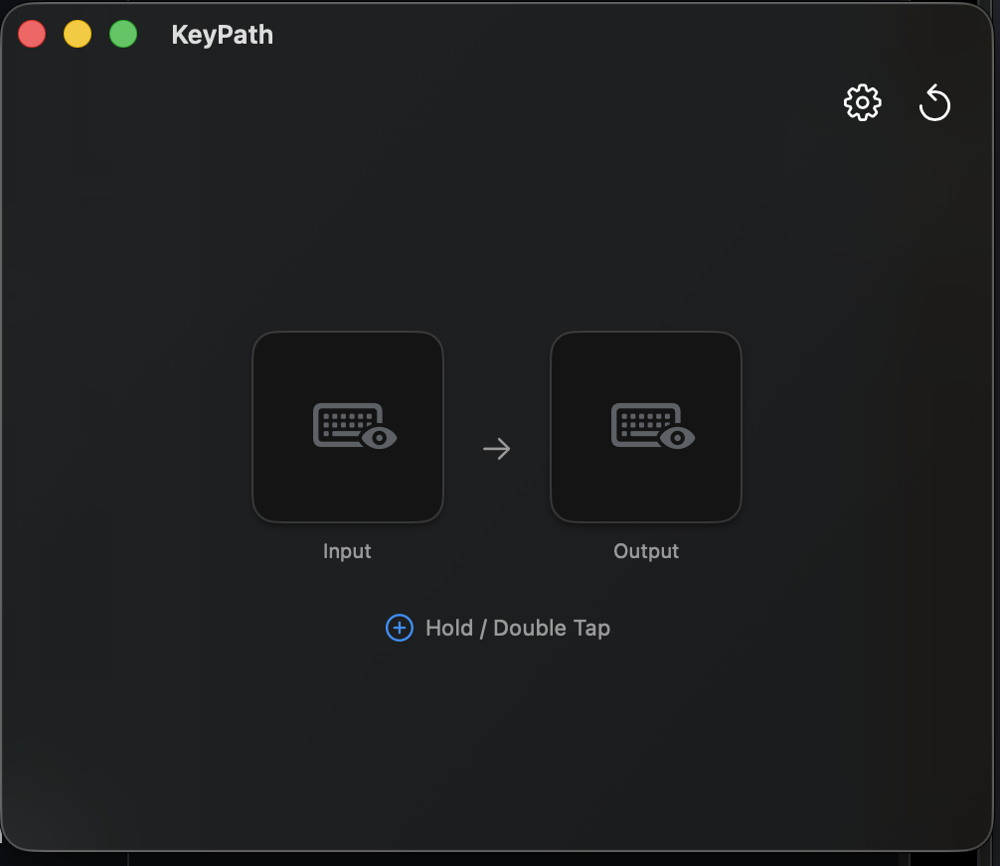
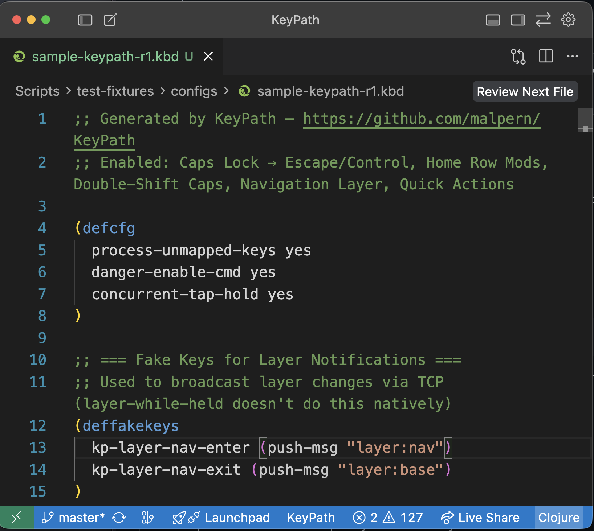
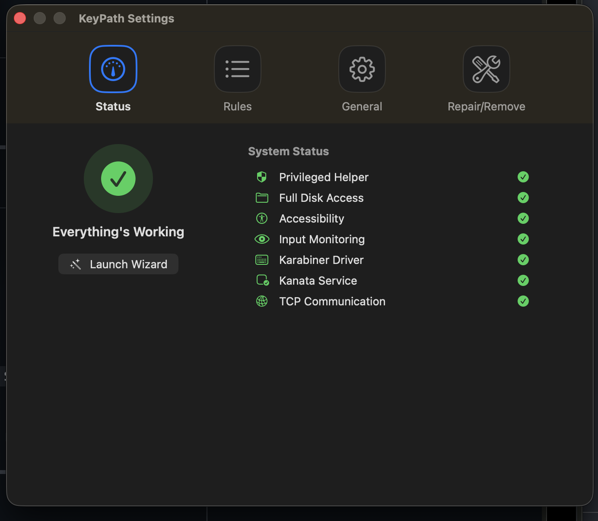
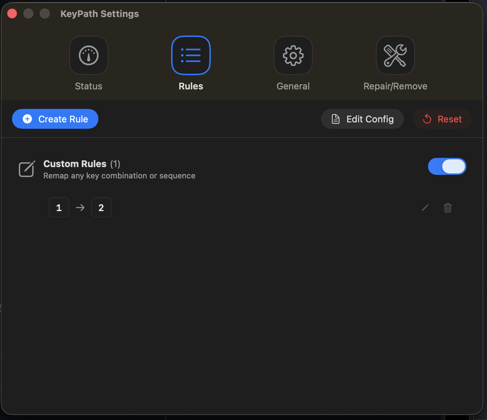

# KeyPath

<div align="center">
  

  **A more comfortable, more powerful Mac keyboard.**

  [](https://www.apple.com/macos/)
  [](LICENSE)
</div>

---

## What Can KeyPath Do?

| Want to... | KeyPath can do it |
|------------|-------------------|
| Make Caps Lock act as Escape | ✓ |
| Caps Lock = Escape when tapped, Control when held | ✓ |
| Double-tap Shift for Caps Lock | ✓ |
| Home Row Mods (A/S/D/F → Ctrl/Alt/Cmd/Shift) | ✓ |
| Create custom modifier combinations | ✓ |
| Layer-based remapping (Vim-style navigation) | ✓ |
| Fix a broken or annoying key | ✓ |

---

## Simple to Start

Your keyboard should work for you, not against you.

KeyPath lets you remap keys and create custom shortcuts **just by pressing them**. No config files to edit. No syntax to learn. No terminal commands. Just press the key you want to change, press what you want it to become, and you're done.

- **Press-to-record**: Capture any key or shortcut, then map it to what you actually want
- **Instant feedback**: Changes apply immediately—no restart, no save-and-wait
- **Visual rule editor**: See your remappings at a glance, toggle them on and off
- **Guided setup**: A wizard walks you through permissions and driver installation

<div align="center">
  
</div>

---

## Getting Started

1. **Download** from the [Releases page](https://github.com/malpern/KeyPath/releases)
2. **Open** KeyPath.app
3. **Follow** the setup wizard (grants permissions, installs driver)
4. **Create** your first rule and click Save

That's it. Your keyboard is now remapped.

---

## Seriously Powerful

<div align="center">
  <a href="https://github.com/jtroo/kanata">
    
  </a>

  **Powered by [Kanata](https://github.com/jtroo/kanata)** · *Created by [jtroo](https://github.com/jtroo)*
</div>

Under the hood, KeyPath is built on **Kanata**—a cross-platform keyboard remapping engine inspired by [KMonad](https://github.com/kmonad/kmonad), with firmware-grade capabilities that go far beyond tools like Karabiner-Elements.

| Capability | KeyPath (Kanata) | Karabiner-Elements |
|------------|------------------|-------------------|
| **[True layers](https://anniecherkaev.com/principles-for-keyboard-layouts)** | Keys change meaning based on active layer | Profiles are global; layers require complex JSON |
| **[Reliable tap-hold](https://thomasbaart.nl/2018/12/09/qmk-basics-tap-and-hold-actions/)** | Multiple detection strategies for different use cases | Basic tap-hold with less tuning options |
| **[Composable conditions](https://github.com/jtroo/kanata/blob/main/docs/config.adoc#switch)** | Combine timing, layer state, and key history | Conditions are separate JSON objects |
| **[Low latency](https://danluu.com/keyboard-latency/)** | Purpose-built for real-time input | JSON parsing can add overhead |

**KeyPath gives you Kanata's power through a visual interface.** You get the best of both worlds: firmware-level capability, zero config-file friction.

### Full Access to the Config File

Power users can open and edit the Kanata config directly:

```
~/Library/Application Support/KeyPath/keypath.kbd
```

<div align="center">
  
</div>

Start with KeyPath's UI, and graduate to hand-editing only when you want to. Your visual rules and manual edits coexist in the same file. See the [Kanata configuration guide](https://github.com/jtroo/kanata/blob/main/docs/config.adoc) for the complete reference.

---

## Features

- **Visual rule editor** — No config files to write
- **Tap-hold keys** — One action when tapped, another when held
- **Tap-dance** — Different actions for single, double, or triple tap
- **Instant apply** — Changes work immediately
- **Emergency stop** — Press `Ctrl + Space + Esc` to disable everything
- **Works at boot** — Remappings active before you log in

---

## Home Row Mods

KeyPath is the only Mac tool that enables [Home Row Mods](https://precondition.github.io/home-row-mods) in pure software with reliability comparable to QMK or ZMK firmware.

**What are they?** HRM turns home row keys (A, S, D, F) into dual-function keys—tap for the letter, hold for a modifier (Ctrl, Alt, Cmd, Shift). No more reaching for modifier keys.

**Why does KeyPath succeed where others fail?** Most tools use timeout-only detection, which causes constant misfires. Kanata uses *press-aware* detection—if another key is pressed while the home row key is down, it's a hold. This is the same approach that makes HRM reliable on custom mechanical keyboards.

→ [Deep dive: Why HRM is hard and how Kanata solves it](docs/HOME_ROW_MODS_DEEP_DIVE.md)

---

## Requirements

- macOS 14.0 (Sonoma) or later
- Apple Silicon or Intel Mac

### System Permissions

KeyPath needs:
- **Input Monitoring** — to see your key presses
- **Accessibility** — to send the remapped keys
- **Karabiner VirtualHID Driver** — creates the virtual keyboard device
- **Admin password** — to install the background service (one-time)

The setup wizard handles all of this automatically.

---

## Safety

**Emergency stop:** Press `Ctrl + Space + Esc` to instantly disable all remappings.

**Privacy:** KeyPath works entirely offline. No data collection, no telemetry.

---

## Settings

Open Settings with **Cmd+,** or click the gear icon.

<div align="center">
  
</div>

- **Status** — System health at a glance. Green checkmarks = everything's working.
- **Rules** — View and manage your custom rules. Toggle on/off, edit, or delete.

<div align="center">
  
</div>

- **General** — Configure capture mode and access logs.
- **Repair/Remove** — Fix common issues or uninstall completely.

---

## Uninstall

To completely remove KeyPath: **Settings → Repair/Remove → Uninstall**

---

## Documentation

For complete documentation, see the **KeyPath Configuration Guide**:
- **[Online Documentation](https://malpern.github.io/KeyPath/KEYPATH_GUIDE.html)** — Formatted for easy reading
- **[AsciiDoc Source](docs/KEYPATH_GUIDE.adoc)** — Source file

The guide covers tap-hold, tap-dance, the `keypath://` action URI system, CLI reference, and troubleshooting.

---

## Background

KeyPath is a macOS frontend for [Kanata](https://github.com/jtroo/kanata), created by [jtroo](https://github.com/jtroo). Using Kanata directly means dealing with driver installation, permission debugging, service management, and config files. KeyPath handles all of that.

Built with Swift and SwiftUI. Uses [Karabiner VirtualHID Driver](https://github.com/pqrs-org/Karabiner-DriverKit-VirtualHIDDevice) for system-level key events.

---

## Contributing

```bash
git clone https://github.com/malpern/KeyPath.git
cd KeyPath
swift build && swift test
```

See [CONTRIBUTING.md](CONTRIBUTING.md) for more.

---

## License

KeyPath is released under the **MIT License** — see [LICENSE](LICENSE)

KeyPath bundles [Kanata](https://github.com/jtroo/kanata) (LGPL-3.0). See [THIRD_PARTY_LICENSES.md](THIRD_PARTY_LICENSES.md).

---

## Other Mac Tools We Appreciate

- **[Karabiner-Elements](https://karabiner-elements.pqrs.org/)** — The OG Mac keyboard remapper
- **[Keyboard Maestro](https://www.keyboardmaestro.com/)** — Swiss Army knife of Mac automation
- **[Hammerspoon](https://www.hammerspoon.org/)** — Lua-powered automation
- **[Raycast](https://www.raycast.com/)** — Modern launcher with extensible commands
- **[LeaderKey](https://github.com/mikker/LeaderKey.app)** — Vim-inspired nested shortcuts for Mac

---

<div align="center">
  <strong>Made with ❤️ for the Mac community</strong>

  <p>If KeyPath helps you, consider starring the repo!</p>

  <a href="https://github.com/malpern/KeyPath">GitHub</a> ・ <a href="https://x.com/malpern">@malpern</a>
</div>
