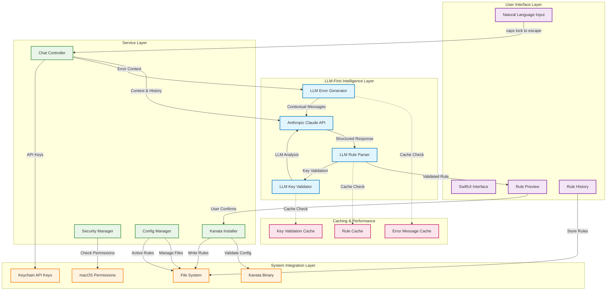

<div align="center">

# ⌨️ &nbsp;&nbsp;KeyPath

**Keyboard Remapping Made Simple**

[](https://www.apple.com/macos/)
[](https://swift.org/)
[](LICENSE)

</div>

## Overview

KeyPath is an intuitive macOS application that makes keyboard remapping accessible to everyone. Powered by AI, it translates natural language descriptions into powerful keyboard customizations using [Kanata](https://github.com/jtroo/kanata) under the hood.

### 🚨 Important: LLM-First Architecture

KeyPath follows an **LLM-first design philosophy**. This means we prioritize intelligent, flexible understanding of user input over rigid validation rules. Please read [ARCHITECTURE.md](ARCHITECTURE.md) before contributing to understand our approach to avoiding hardcoded logic.

## Features

- **Natural Language Input**: Describe your desired keyboard behavior in plain English
- **AI-Powered Translation**: Automatically converts descriptions to Kanata configuration rules
- **Visual Rule Preview**: See your remappings visualized before applying them
- **Instant Application**: Apply keyboard changes without restarting
- **Rule History**: Track and undo recent changes
- **Liquid Glass UI**: Beautiful, modern interface following Apple's latest design guidelines

## Examples

Simply describe what you want:

- "Make caps lock act as escape when tapped, control when held"
- "Swap command and option keys"
- "Create vim-style arrow keys with hjkl when holding space"
- "Make the right shift key type an underscore"

## Requirements

- macOS 14.0+ (optimized for macOS 26.0 Tahoe)
- [Kanata](https://github.com/jtroo/kanata) keyboard remapper
- Anthropic API key (for AI translation)

## Installation

1. Clone the repository:
```bash
git clone https://github.com/malpern/KeyPath.git
```

2. Open the project in Xcode:
```bash
cd KeyPath
open KeyPath.xcodeproj
```

3. Build and run the application

4. Follow the in-app setup wizard to:
   - Install Kanata
   - Configure permissions
   - Add your Anthropic API key

## Usage

1. Launch KeyPath
2. Describe your desired keyboard remapping in the text field
3. Review the generated rule preview
4. Click "Apply" to activate the remapping
5. Use the History feature to undo changes if needed

## Architecture

KeyPath combines several technologies:

- **SwiftUI** with @Observable for modern, reactive UI
- **Anthropic Claude API** for natural language understanding
- **Kanata** for low-level keyboard remapping
- **Liquid Glass Effects** for visual polish

### Architecture Diagram


```mermaid
graph TB
    subgraph "User Interface Layer"
        UI[SwiftUI Interface]
        INPUT[Natural Language Input]
        PREVIEW[Rule Preview]
        HISTORY[Rule History]
    end
    
    subgraph "LLM-First Intelligence Layer"
        LLM[Anthropic Claude API]
        PARSER[LLM Rule Parser]
        VALIDATOR[LLM Key Validator]
        ERROR_GEN[LLM Error Generator]
    end
    
    subgraph "Service Layer"
        CHAT[Chat Controller]
        INSTALLER[Kanata Installer]
        SECURITY[Security Manager]
        CONFIG[Config Manager]
    end
    
    subgraph "System Integration Layer"
        KANATA[Kanata Binary]
        FILESYSTEM[File System]
        PERMISSIONS[macOS Permissions]
        KEYCHAIN[Keychain API Keys]
    end
    
    subgraph "Caching & Performance"
        RULE_CACHE[Rule Cache]
        KEY_CACHE[Key Validation Cache]
        ERROR_CACHE[Error Message Cache]
    end
    
    %% User Flow
    INPUT -->|"caps lock to escape"| CHAT
    CHAT -->|Context & History| LLM
    LLM -->|Structured Response| PARSER
    PARSER -->|Validated Rule| PREVIEW
    PREVIEW -->|User Confirms| INSTALLER
    
    %% LLM Intelligence Flow
    PARSER -.->|Cache Check| RULE_CACHE
    VALIDATOR -.->|Cache Check| KEY_CACHE
    ERROR_GEN -.->|Cache Check| ERROR_CACHE
    
    PARSER -->|Key Validation| VALIDATOR
    VALIDATOR -->|LLM Analysis| LLM
    CHAT -->|Error Context| ERROR_GEN
    ERROR_GEN -->|Contextual Messages| LLM
    
    %% System Integration Flow
    INSTALLER -->|Validate Config| KANATA
    INSTALLER -->|Write Rules| FILESYSTEM
    SECURITY -->|Check Permissions| PERMISSIONS
    CONFIG -->|Manage Files| FILESYSTEM
    CHAT -->|API Keys| KEYCHAIN
    
    %% Data Persistence
    HISTORY -->|Store Rules| FILESYSTEM
    CONFIG -->|Active Rules| FILESYSTEM
    
    %% Styling
    classDef llm fill:#e1f5fe,stroke:#0277bd,stroke-width:2px
    classDef ui fill:#f3e5f5,stroke:#7b1fa2,stroke-width:2px
    classDef service fill:#e8f5e8,stroke:#388e3c,stroke-width:2px
    classDef system fill:#fff3e0,stroke:#f57c00,stroke-width:2px
    classDef cache fill:#fce4ec,stroke:#c2185b,stroke-width:2px
    
    class LLM,PARSER,VALIDATOR,ERROR_GEN llm
    class UI,INPUT,PREVIEW,HISTORY ui
    class CHAT,INSTALLER,SECURITY,CONFIG service
    class KANATA,FILESYSTEM,PERMISSIONS,KEYCHAIN system
    class RULE_CACHE,KEY_CACHE,ERROR_CACHE cache
```

#### Key Architectural Principles:

🧠 **LLM-First Intelligence**: All Kanata-specific logic flows through the LLM layer
⚡ **Smart Caching**: Frequently used validations and rules are cached for performance  
🔄 **Async Processing**: Non-blocking operations maintain UI responsiveness
🛡️ **Security Integration**: Proper macOS permission handling and secure API key storage
📝 **External Validation**: Final rule validation uses the actual Kanata binary

### Design Philosophy: LLM-First Architecture

KeyPath follows a deliberate design philosophy that leverages the LLM (Large Language Model) for all Kanata-specific logic rather than hardcoding it into the application. This approach ensures:

1. **Future-Proof**: As Kanata evolves and adds new features, KeyPath automatically supports them without code changes
2. **Maintainable**: No complex Kanata syntax rules to maintain in the codebase
3. **Flexible**: Can handle edge cases and unusual configurations without updates
4. **Simple**: The codebase remains focused on UI/UX and system integration

### Configuration Architecture: Inspired by Karabiner-Elements

KeyPath's rule management is inspired by [Karabiner-Elements](https://github.com/pqrs-org/Karabiner-Elements)' elegant approach to configuration management:

- **Individual Rules**: Each rule is a complete, self-contained Kanata configuration block
- **Simple Concatenation**: The final config file is created by combining all active rules
- **No Complex Merging**: Rules are independent and don't require sophisticated merging logic
- **Toggle-Friendly**: Rules can be easily enabled/disabled by including/excluding them from the final config

This design choice eliminates the need for complex rule parsing and merging algorithms, instead relying on the natural modularity of well-structured configuration blocks.

#### What the LLM Handles:
- **Rule Generation**: Converting natural language to Kanata syntax
- **Syntax Validation**: Understanding valid Kanata configurations
- **Error Correction**: Fixing invalid rules based on validation feedback
- **Key Name Validation**: Knowing which key names are valid in Kanata
- **Configuration Merging**: Understanding how to combine multiple rules
- **Display Formatting**: Providing user-friendly descriptions of rules

#### What the App Handles:
- **System Integration**: File I/O, process management, permissions
- **UI/UX**: Visual components, animations, user interactions
- **External Validation**: Using the actual Kanata binary to validate configs
- **State Management**: Tracking rules, history, and application state
- **API Communication**: Managing the connection to the LLM

This separation of concerns means that KeyPath can adapt to any changes in Kanata's syntax or capabilities without requiring application updates, as long as the LLM is aware of those changes.

## Contributing

Contributions are welcome! Please feel free to submit a Pull Request.

### Development Guidelines

When contributing to KeyPath, please follow these principles:

1. **Avoid Hardcoding Kanata Logic**: 
   - ❌ Don't write functions that generate Kanata syntax
   - ❌ Don't maintain lists of valid Kanata key names
   - ❌ Don't implement Kanata configuration parsing logic
   - ✅ Do use the LLM to handle all Kanata-specific operations

2. **LLM Integration Pattern**:
   ```swift
   // Bad: Hardcoded logic
   func generateTapHoldRule(key: String, tap: String, hold: String) -> String {
       return "(defalias \(key) (tap-hold 200 200 \(tap) \(hold)))"
   }
   
   // Good: LLM-driven logic
   func generateRule(description: String) async -> KanataRule {
       return try await llm.generateRule(from: description)
   }
   ```

3. **Validation Approach**:
   - Use the Kanata binary for final validation
   - Let the LLM handle syntax understanding and error correction
   - The app should only orchestrate, not interpret

4. **Future Features**:
   - New Kanata features should work automatically
   - If they don't, update the LLM prompts, not the code
   - Keep the codebase Kanata-agnostic where possible

## License

This project is available under the [MIT License](LICENSE).

## Acknowledgments

- Chat interface based on [Apple Intelligence Chat](https://github.com/PallavAg/Apple-Intelligence-Chat) by Pallav Agarwal
- Built with [Kanata](https://github.com/jtroo/kanata) by jtroo
- AI powered by [Anthropic Claude](https://www.anthropic.com/)
- Configuration architecture inspired by [Karabiner-Elements](https://github.com/pqrs-org/Karabiner-Elements) by pqrs-org
- Liquid Glass UI design inspired by Apple's WWDC 2025 guidelines
# Test change
