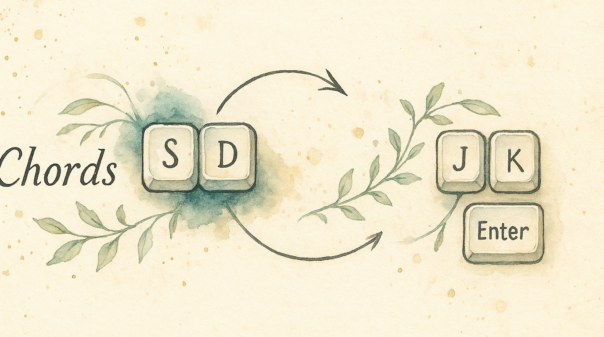

# Press Two Keys at Once

Reaching for Escape, Backspace, or Enter means leaving the home row. Chords let you press two adjacent keys simultaneously to produce any of these — no reaching required. Press `S` and `D` together for Escape. Press `J` and `K` for Enter. Your fingers barely move.

This technique was popularized by [Ben Vallack](https://www.youtube.com/@BenVallack) for ultra-efficient home-row-centric typing on small keyboards, but it works just as well on a full-size board.

---

## Quick Start

1. Open KeyPath and click the gear icon to open the inspector panel
2. Go to the **Rules** tab
3. Find **Chord Groups** and toggle it **on**
4. Choose **Load Ben Vallack Preset** for a ready-made starting point, or **Create Custom** to build your own

The preset gives you:
- `S + D` → Escape
- `D + F` → Enter
- `J + K` → Up Arrow
- `K + L` → Down Arrow
- `A + S` → Backspace

<!-- screenshot: id="chords-collection-view" method="snapshot" view="ChordGroupsCollectionView" state="groups:2,chords:5,activeGroup:navigation" -->

---

## How Chords Work

A chord detects when you press two (or more) keys within a short time window — the **timeout**. If both keys land within that window, the chord fires. If only one key lands, it types normally.

```
  Press S alone → types "s"
  Press D alone → types "d"
  Press S + D together (within 250ms) → fires Escape
```

Order doesn't matter — pressing S then D, or D then S, both trigger the same chord as long as they're within the timeout window.

---

## The Chord Editor

Click **Open Full Editor** to configure your chords in detail:

**Left sidebar** — Your chord groups (you can have multiple groups organized by purpose)

**Right panel** — The selected group's settings:
- **Group name** — identifier (letters, numbers, hyphens only)
- **Category** — Navigation, Editing, Symbols, Modifiers, or Custom
- **Timeout** — how quickly both keys must be pressed
- **Chord list** — each chord showing its keys, output, and an ergonomic score

### Speed presets

| Preset | Timeout | Best for |
|--------|---------|----------|
| Lightning | 150ms | Experts with precise timing |
| Fast | 250ms | Most users (Ben Vallack's preference) |
| Moderate | 400ms | Learning chords |
| Deliberate | 600ms | Easiest to trigger reliably |

Start with **Fast** (250ms) and adjust once you develop muscle memory.

---

## Choosing Good Chord Keys

Not all key pairs are equally comfortable. KeyPath shows an **ergonomic score** for each chord:

- **Excellent** — Adjacent home row keys (S+D, D+F, J+K, K+L). Easiest to press together.
- **Good** — Same hand, all home row (e.g., S+F)
- **Moderate** — Same hand, mixed rows
- **Fair** — Cross-hand combinations
- **Poor** — Awkward stretches

Stick to adjacent home row pairs for your most-used chords.

---

## Organizing with Groups

Chord groups let you organize chords by purpose and set different timeouts per group:

- **Navigation** (250ms) — arrows, page up/down, home/end
- **Editing** (400ms) — backspace, delete, cut, undo
- **Symbols** (150ms) — quick symbol access
- **Modifiers** (600ms) — deliberate modifier combos

Each group generates its own detection window, so navigation chords can be fast while editing chords give you more time.

---

## Conflict Detection

KeyPath warns you when:
- The same key pair is used in multiple chords (within a group)
- A chord's keys overlap with another chord (e.g., `S+D` and `S+D+F` — the two-key chord always fires first)
- Keys are shared across groups (the first group in the list takes priority)

Orange warning indicators appear in the editor when conflicts are detected.

---

## Tips

- **Start small** — Begin with 2–3 chords for your most common reaches (Escape, Enter, Backspace) and add more as they become automatic
- **Adjacent keys win** — S+D, D+F, J+K are the easiest combos because your fingers are already there
- **Don't chord letters** — Avoid mapping common bigrams (like T+H, I+N) as chords — they'll misfire during fast typing
- **Combine with home row mods** — Chords and [home row mods](help:home-row-mods) complement each other: HRM gives you modifiers, chords give you editing keys

---

## Troubleshooting

### Chord fires when I'm just typing fast

Lower the timeout (try 150ms), or choose key pairs that aren't common bigrams in English.

### Chord doesn't fire reliably

Increase the timeout (try 400ms), or practice pressing both keys more simultaneously.

### Individual keys feel delayed

This is the tradeoff: the engine waits the timeout duration to see if a second key arrives. Shorter timeouts reduce the delay but require more precise timing. 250ms is the sweet spot for most users.

---

## Next Steps

- **[Shortcuts Without Reaching](help:home-row-mods)** — Combine chords with home row modifiers for a complete home-row setup
- **[One Key, Multiple Actions](help:tap-hold)** — Tap-hold for keys that need two roles
- **[What You Can Build](help:use-cases)** — See chords as part of a full keyboard workflow
- **[Keyboard Concepts](help:concepts)** — Background on layers and dual-role keys
- **[Back to Docs](https://malpern.github.io/KeyPath/docs)**

## External resources

- **[Ben Vallack's chord workflow](https://www.youtube.com/@BenVallack)** — The popularizer of home-row chords, with practical demos ↗
- **[Kanata defchords documentation](https://github.com/jtroo/kanata/blob/main/docs/config.adoc#chords)** — Full reference for the chord engine ↗
