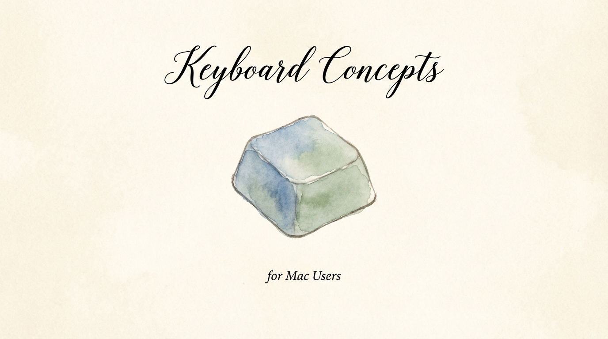

# Keyboard Concepts for Mac Users

If you've never customized a keyboard beyond **System Settings > Keyboard > Modifier Keys**, this page is for you. These are the core ideas behind keyboard remapping — they apply regardless of which tool you use.

---

## What keyboard remapping actually does

You already know you can swap Caps Lock and Control in System Settings. Keyboard remapping is the same idea, but far more powerful:

- Remap *any* key to *any* other key (not just modifiers)
- Make a single key do different things depending on *how* you press it
- Create entirely separate keyboard layouts you can switch between
- Set up app-specific shortcuts that only activate in certain applications

System Settings gives you a few checkboxes. Keyboard remapping gives you a programming language for your keyboard.

```
  System Settings:              Keyboard Remapping:

  ☐ Swap Caps Lock → Control   Any key → any key
  ☐ Swap Option → Command      One key → two functions
                                Layers, sequences, chords
  That's it.                    App-specific shortcuts
                                Tap-hold, tap-dance
                                Launch apps, tile windows
                                ...and much more
```

---

## Keys, modifiers, and shortcuts

You already use these every day on your Mac:

| macOS name | Symbol | What it does |
|---|---|---|
| **Command** | ⌘ | The primary modifier — ⌘C to copy, ⌘V to paste |
| **Option** | ⌥ | Secondary modifier — special characters, alternate actions |
| **Control** | ⌃ | Used in Terminal, Emacs-style shortcuts |
| **Shift** | ⇧ | Uppercase letters, alternate toolbar actions |

A **shortcut** is a modifier held together with another key: ⌘S to save, ⌥⌘Esc to force quit.

In keyboard remapping, we can make *any* key act as a modifier — including your home row letter keys.

---

## Layers

Think of layers like having multiple keyboards stacked on top of each other. You're always typing on one layer, and you can switch between them.

```
  Layer 0 (Base)         Layer 1 (Navigation)
  ┌───┬───┬───┬───┐     ┌───┬───┬───┬───┐
  │ Q │ W │ E │ R │     │   │   │   │   │
  ├───┼───┼───┼───┤     ├───┼───┼───┼───┤
  │ A │ S │ D │ F │     │ ← │ ↓ │ ↑ │ → │
  ├───┼───┼───┼───┤     ├───┼───┼───┼───┤
  │ Z │ X │ C │ V │     │   │   │   │   │
  └───┴───┴───┴───┘     └───┴───┴───┴───┘

  Hold a key to switch → arrows on the home row!
```

**You already use layers on your Mac** — holding Shift gives you a different "layer" of characters (uppercase letters, symbols like ! @ # $). Keyboard remapping just lets you create as many additional layers as you want.

Common uses:
- **Navigation layer** — arrow keys, Page Up/Down, Home/End on the home row
- **Number layer** — a numpad layout under your right hand
- **Symbol layer** — brackets, braces, and programming symbols within easy reach

---

## Tap-hold (dual-role keys)

This is the most powerful concept in keyboard remapping: **one key, two jobs**.

- **Tap** the key quickly → it types the letter
- **Hold** the key down → it acts as a modifier

```
  ┌─────────┐
  │    F    │   Tap  → types "f"
  │   ⌘     │   Hold → acts as Command
  └─────────┘
```

For example, you could make the F key type "f" when tapped but act as Command when held. Press and release F quickly: you get the letter f. Hold F and press C: you get ⌘C (Copy).

This is how [home row mods](help:home-row-mods) work — your home row letter keys double as modifiers, so you never have to reach for Command, Option, Control, or Shift.

The tricky part is timing — how does the system know if you meant to tap or hold?

```
  ── Time ──────────────────────────────→

  Quick tap:   ╔══╗                       → "f" (the letter)
               ╚══╝
               press  release
               < 200ms

  Slow hold:   ╔══════════════╗           → Command (the modifier)
               ╚══════════════╝
               press           release
               ·····200ms····→

  The threshold (usually ~200ms) determines the split.
  Too short = accidental modifiers. Too long = sluggish letters.
```

Good remapping tools give you control over the threshold, per-finger sensitivity, and what happens when you press another key during the decision window. See the [Tap-Hold guide](help:tap-hold) for the details.

---

## Tap-dance

Tap-dance takes the dual-role idea further: **different actions based on how many times you tap**.

```
  Caps Lock:
    1 tap  → Escape
    2 taps → Caps Lock (the original function)
    3 taps → Control
```

This is great for keys you rarely use — you can pack multiple functions into a single key without adding complexity to your everyday typing.

---

## Home row mods

Home row mods combine tap-hold with your home row keys (A S D F / J K L ;) to turn them into modifiers when held:

```
  ┌─────┐ ┌─────┐ ┌─────┐ ┌─────┐     ┌─────┐ ┌─────┐ ┌─────┐ ┌─────┐
  │  A  │ │  S  │ │  D  │ │  F  │     │  J  │ │  K  │ │  L  │ │  ;  │
  │ ⇧   │ │ ⌃   │ │ ⌥   │ │ ⌘   │     │ ⌘   │ │ ⌥   │ │ ⌃   │ │ ⇧   │
  └─────┘ └─────┘ └─────┘ └─────┘     └─────┘ └─────┘ └─────┘ └─────┘
              Tap for letters, hold for modifiers
```

This is the most popular advanced keyboard technique. Your fingers never leave the home row to hit modifiers — everything is right under your fingertips.

The challenge is avoiding misfires during fast typing. Good implementations use split-hand detection (same-hand = letter, cross-hand = modifier) and per-finger timing to make it reliable.

Read the full [Home Row Mods guide](help:home-row-mods) for a deep dive.

---

## Hyper and Meh keys

Power users often create "super modifiers" that don't exist on a standard keyboard:

- **Hyper** = Control + Option + Command + Shift (all four modifiers at once)
- **Meh** = Control + Option + Shift (three modifiers, no Command)

Since no app uses these combinations, they give you a huge namespace of shortcuts that will never conflict with anything. Tap Caps Lock to get Escape, hold it for Hyper — now every letter key becomes a unique, conflict-free shortcut.

```
  Standard modifiers:
  ⌘A  ⌘B  ⌘C ... already taken by apps

  Hyper (⌃⌥⌘⇧):
  Hyper+A  Hyper+B  Hyper+C ... all yours!

  26 letters + 10 numbers = 36 conflict-free shortcuts
  from a single modifier key
```

---

## Chords and sequences

Beyond single keys, you can trigger actions from combinations:

- **Chord** — press two keys simultaneously (e.g., J+K together → trigger an action)
- **Sequence** — press keys one after another (e.g., Space then S then M → open Messages)
- **Leader key** — press a "leader" key, then type a short sequence. Like Vim's leader key but for your whole system.

These let you create memorable shortcuts without running out of modifier combinations.

```
  Chord (simultaneous):     Sequence (one after another):

  ┌───┐ ┌───┐              ┌───┐     ┌───┐     ┌───┐
  │ J │+│ K │ = action      │SPC│ ──→ │ G │ ──→ │ H │ = open GitHub
  └───┘ └───┘              └───┘     └───┘     └───┘
  pressed together          pressed in order
```

---

## Where to go next

- **[What You Can Build](help:use-cases)** — Concrete examples of what's possible with KeyPath
- **[Your First Mapping](https://keypath-app.com/getting-started/first-mapping)** — Create a simple remap to get started
- **[Home Row Mods](help:home-row-mods)** — The most popular advanced technique
- **[Tap-Hold & Tap-Dance](help:tap-hold)** — All the details on dual-role keys
- **[Back to Docs](https://keypath-app.com/docs)** — See all available guides

## External resources

These community resources go deeper into keyboard customization concepts:

- **[The Home Row Mods Guide (Precondition)](https://precondition.github.io/home-row-mods)** — The definitive community reference on home row mods ↗
- **[Kanata documentation](https://github.com/jtroo/kanata/blob/main/docs/config.adoc)** — Full configuration reference for the engine behind KeyPath ↗
- **[QMK Firmware](https://docs.qmk.fm/)** — If you're interested in firmware-level remapping on custom keyboards ↗
- **[r/ErgoMechKeyboards](https://www.reddit.com/r/ErgoMechKeyboards/)** — Active community discussing keyboard layouts, layers, and ergonomics ↗
- **[Karabiner-Elements](https://karabiner-elements.pqrs.org/)** — Another macOS remapping tool, if you want to compare approaches ↗
- **[Ben Vallack's keyboard videos](https://www.youtube.com/@BenVallack)** — Advanced keyboard layout exploration and experimentation ↗
