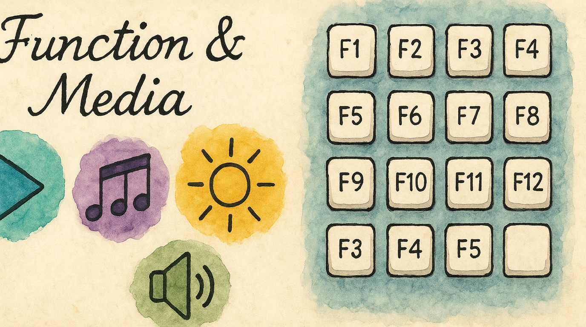

# F-Keys and Media Without Reaching

F-keys live in a row you never touch. Volume and brightness require holding Fn or hunting for Touch Bar ghosts. The Function layer puts F1–F12 on your right hand in a numpad grid, and media/brightness controls on your left — all from the home row.

---

## What You Get

Enable the **Function** pack and you gain:

**Right hand — F-keys (numpad grid):**

| U | I | O |
|---|---|---|
| F7 | F8 | F9 |

| J | K | L |
|---|---|---|
| F4 | F5 | F6 |

| M | , | . |
|---|---|---|
| F1 | F2 | F3 |

| N | / | ; |
|---|---|---|
| F10 | F11 | F12 |

**Left hand — media and system:**

| Key | Action |
|-----|--------|
| F | Play / Pause ⏯ |
| D | Previous Track ⏮ |
| S | Next Track ⏭ |
| A | Mute 🔇 |
| G | Volume Up 🔊 |
| R | Volume Down 🔉 |
| V | Brightness Up ☀️ |
| C | Brightness Down 🔅 |

---

## Enabling It

1. Open KeyPath and click the gear icon to open the inspector panel
2. Go to the **Rules** tab
3. Find **Function** in the Layers section
4. Toggle it **on**

Requires **Vim Navigation** (or another Leader pack) to be enabled.

---

## How to Activate

Two-step activation:

1. **Hold your Leader key** (Space by default) — enters the navigation layer
2. **While holding Leader, press F** — enters the function layer
3. **Press F-key or media keys** — fires the mapped action
4. **Release Leader** — back to normal typing

The **F** activator is a mnemonic for "Function."

---

## Use Cases

- **Xcode debugging** — F6 (Step Over), F7 (Step Into), F8 (Step Out) are right under J/K/L
- **Browser dev tools** — F12 opens DevTools in most browsers (press ;)
- **Audio/video editing** — Play/Pause and track skip without leaving the keyboard
- **Presentations** — F5 starts slideshows in many apps
- **Brightness control** — Adjust screen brightness without finding the Touch Bar or function row

---

## Tips

- The F-key grid matches the Numpad layer layout — same finger positions, different outputs. Learn one and the other comes free.
- **Media keys on the left hand** means you can skip tracks or adjust volume with one hand while the other stays on the mouse
- F-keys fire instantly — no hold threshold. Press and release.
- Works with apps that bind to function keys (Xcode, Photoshop, Excel) — they receive real F-key events

---

## Troubleshooting

### F-keys don't work in my app

Some macOS apps require "Use F1, F2, etc. as standard function keys" to be enabled in System Settings → Keyboard. KeyPath sends real F-key events, but the system may intercept them for brightness/volume if that setting is off — though KeyPath's layer bypasses this for keys in the layer.

### Media keys have no effect

1. Verify the Function layer is activated (check overlay)
2. Some apps override media key handling — try with Music.app or Spotify to confirm
3. Check that System Settings hasn't disabled media key passthrough

### Leader → F conflicts with Vim Navigation's F key

In the base navigation layer, **F** is not mapped by default (Vim Navigation uses H/J/K/L). The F key is reserved specifically for Function layer activation.

---

## Next Steps

- **[Navigate Text Like a Keyboard Ninja](help:vim-navigation)** — The foundation layer (required for function keys)
- **[Choose Your Leader Key](help:leader-key)** — Change which key starts the activation
- **[Keyboard Concepts](help:concepts)** — Background on layers and two-step activation
- **[Back to Docs](https://malpern.github.io/KeyPath/docs)**
