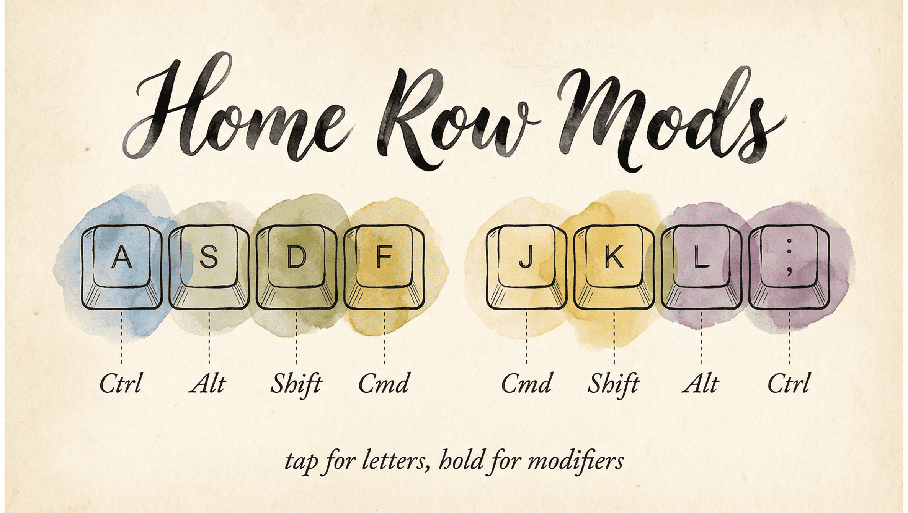

# Home Row Mods

```
  ┌─────┐ ┌─────┐ ┌─────┐ ┌─────┐     ┌─────┐ ┌─────┐ ┌─────┐ ┌─────┐
  │  A  │ │  S  │ │  D  │ │  F  │     │  J  │ │  K  │ │  L  │ │  ;  │
  │ ⇧   │ │ ⌃   │ │ ⌥   │ │ ⌘   │     │ ⌘   │ │ ⌥   │ │ ⌃   │ │ ⇧   │
  └─────┘ └─────┘ └─────┘ └─────┘     └─────┘ └─────┘ └─────┘ └─────┘
              Tap for letters, hold for modifiers
```

Home row mods turn your home row keys (A S D F / J K L ;) into dual-role keys: **tap** for the letter, **hold** for a modifier. Your fingers never leave the home row to reach Shift, Control, Option, or Command.

If you're new to keyboard customization, read [Keyboard Concepts for Mac Users](help:concepts) first for background on tap-hold and layers.

---

## What are home row mods?

Every home row key gets a second job:

| Key | Tap | Hold |
|---|---|---|
| A | a | Shift (⇧) |
| S | s | Control (⌃) |
| D | d | Option (⌥) |
| F | f | Command (⌘) |
| J | j | Command (⌘) |
| K | k | Option (⌥) |
| L | l | Control (⌃) |
| ; | ; | Shift (⇧) |

This is the **CAGS** layout (Command on index, Alt/Option on middle, Control on ring, Shift on pinky) — mirrored on both hands.

The result: any keyboard shortcut is one fluid motion. Hold F + press C = ⌘C (Copy). Hold A + press tab = ⇧Tab (Shift-Tab). No reaching, no contortion.

---

## Getting started with defaults

1. Open KeyPath
2. Enable **Home Row Mods** in the settings
3. Start typing normally

The defaults use the CAGS layout shown above. Practice for a few days — occasional misfires during fast typing are normal at first and improve as you adjust.

```
  Pinky  →  Shift        Ring  →  Control
  Middle →  Option       Index →  Command
```

**Tip:** Start by using home row mods only for shortcuts you already know (⌘C, ⌘V, ⌘Z). Once those feel natural, expand to new shortcuts.

---

## Tuning your setup

### Typing Feel slider

KeyPath provides a slider to adjust the tap-hold threshold:

```
  ├──── Tap (letter) ────┼──── Hold (modifier) ────┤
  0 ms                 200 ms                    ∞
```

- Slide toward **"More Letters"** for a longer tap window (fewer accidental modifiers)
- Slide toward **"More Modifiers"** for quicker modifier activation

### Per-finger sensitivity

Pinkies are slower than index fingers. KeyPath lets you add extra tolerance for slower fingers to prevent accidental holds:

```
  Pinky   ████████████████████░  (most tolerance)
  Ring    █████████████░░░░░░░░
  Middle  █████████░░░░░░░░░░░░
  Index   ██████░░░░░░░░░░░░░░░  (least tolerance)
```

### Quick tap

When enabled, a quick tap-and-release always produces the letter, even if another key was pressed during the tap window. This is especially helpful for fast typists.

*Start with defaults, then adjust one parameter at a time.*

---

## How KeyPath makes home row mods reliable

### Split-hand detection

KeyPath tracks which keyboard half each key belongs to. This is the key to reliable home row mods:

- **Same-hand key press** during the tap-hold window → immediately produces the letter (fast typing)
- **Opposite-hand key press** → allows the modifier to activate (intentional shortcut)

```
  Left Hand                     Right Hand
  ┌───┬───┬───┬───┬───┐       ┌───┬───┬───┬───┬───┐
  │ Q │ W │ E │ R │ T │       │ Y │ U │ I │ O │ P │
  ├───┼───┼───┼───┼───┤       ├───┼───┼───┼───┼───┤
  │ A │ S │ D │ F │ G │       │ H │ J │ K │ L │ ; │
  ├───┼───┼───┼───┼───┤       ├───┼───┼───┼───┼───┤
  │ Z │ X │ C │ V │ B │       │ N │ M │ , │ . │ / │
  └───┴───┴───┴───┴───┘       └───┴───┴───┴───┴───┘

  Same hand   → tap (letter)      Example: F then D → "fd"
  Cross hand  → hold (modifier)   Example: F then J → ⌘J
```

This is based on Kanata's `tap-hold-release-keys` and the approach recommended by Kanata's creator.

### Per-finger timing

Different fingers move at different speeds. KeyPath lets you give slower fingers (pinkies) more time before the hold activates, while keeping faster fingers (index) responsive. This eliminates most accidental modifier activations.

---

## KeyPath vs. Karabiner-Elements

| Aspect | KeyPath | Karabiner-Elements |
|---|---|---|
| Tap-hold variants | 4 variants, tunable per key | Single `to_if_alone` |
| Split-hand detection | Built-in | Requires complex JSON rules |
| Per-finger timing | Per-key offsets via sliders | Global timeout only |
| Layer integration | Hold-activate layers | Separate rule sets |
| Configuration | Visual UI with sliders | JSON editing |
| Engine | Kanata (purpose-built for tap-hold) | General-purpose JSON rules |

Karabiner-Elements can achieve home row mods, but it requires hand-crafting complex JSON rules and offers fewer anti-misfire tools. KeyPath's Kanata backend was designed with tap-hold as a first-class concept, giving you more precise control with less effort.

---

## Advanced techniques

These are techniques being explored in the mechanical keyboard community. Some are in KeyPath today, others are planned or available through custom Kanata config.

### Anti-cascade / nomods layer

After a tap resolves, temporarily disable all home row mods for the rest of the typing burst, re-enabling them after a brief idle. This prevents chain-reaction misfires.

Pioneered by [Sunaku's home row mods configuration](https://sunaku.github.io/home-row-mods.html), which implements this via a dedicated "nomods" layer in Kanata.

### Typing streak detection

Track sustained typing bursts and suppress modifier activation entirely during the streak. Only re-enable modifiers after a pause. This eliminates nearly all misfires during fast prose typing.

See [Sunaku's bilateral combinations approach](https://sunaku.github.io/home-row-mods.html) for a detailed implementation.

### Achordion / Chordal Hold

QMK firmware libraries (created by [Pascal Getreuer](https://getreuer.info/posts/keyboards/home-row-mods/)) that make the tap/hold decision based on which hand pressed the next key. **Chordal Hold** was merged into QMK core in February 2025, making opposite-hand detection a built-in feature for QMK keyboards.

KeyPath's split-hand detection provides equivalent functionality for standard Mac keyboards via Kanata.

### Eager mods

Apply the modifier immediately while the tap-hold decision is still pending. If the key resolves as a tap, the modifier is retroactively canceled. This reduces perceived latency for intentional modifier use.

Kanata supports eager mode via `tap-hold-press` and `tap-hold-release` variants. See the [Kanata tap-hold documentation](https://github.com/jtroo/kanata/blob/main/docs/config.adoc#tap-hold) for details.

### Shift exemption

Shift is the most frequently used modifier during normal typing (capital letters, punctuation). Advanced configurations exempt Shift from streak suppression and anti-cascade so capitalization works naturally during fast typing, while still suppressing accidental Control, Option, and Command.

---

## Resources

### KeyPath guides

- **[Keyboard Concepts](help:concepts)** — Background on tap-hold, layers, and modifiers
- **[Tap-Hold & Tap-Dance](help:tap-hold)** — Detailed guide to all tap-hold options in KeyPath
- **[What You Can Build](help:use-cases)** — See HRM as part of a complete setup with Hyper key, window tiling, and more
- **[Switching from Karabiner?](help:karabiner-users)** — See how KeyPath's HRM compares to Karabiner's approach
- **[Back to Docs](https://keypath-app.com/docs)**

### External references

- **[The Home Row Mods Guide (Precondition)](https://precondition.github.io/home-row-mods)** — The definitive community reference on HRM layouts and tuning ↗
- **[Pascal Getreuer's home row mods analysis](https://getreuer.info/posts/keyboards/home-row-mods/)** — Technical deep dive on timing, anti-misfire, and Chordal Hold ↗
- **[Sunaku's home row mods](https://sunaku.github.io/home-row-mods.html)** — Advanced anti-cascade and bilateral combinations ↗
- **[Kanata tap-hold documentation](https://github.com/jtroo/kanata/blob/main/docs/config.adoc#tap-hold)** — Full reference for the engine behind KeyPath's tap-hold ↗
- **[jtroo's Kanata config](https://github.com/jtroo/kanata/blob/main/cfg_samples/jtroo.kbd)** — Real-world advanced config from Kanata's creator ↗
- **[QMK Chordal Hold](https://docs.qmk.fm/features/chordal_hold)** — Firmware-level opposite-hand detection (same concept KeyPath uses) ↗
- **[r/ErgoMechKeyboards](https://www.reddit.com/r/ErgoMechKeyboards/)** — Active community discussing HRM tuning and experiences ↗
- **[Ben Vallack's HRM journey](https://www.youtube.com/@BenVallack)** — Practical experiences with home row mods on various layouts ↗
