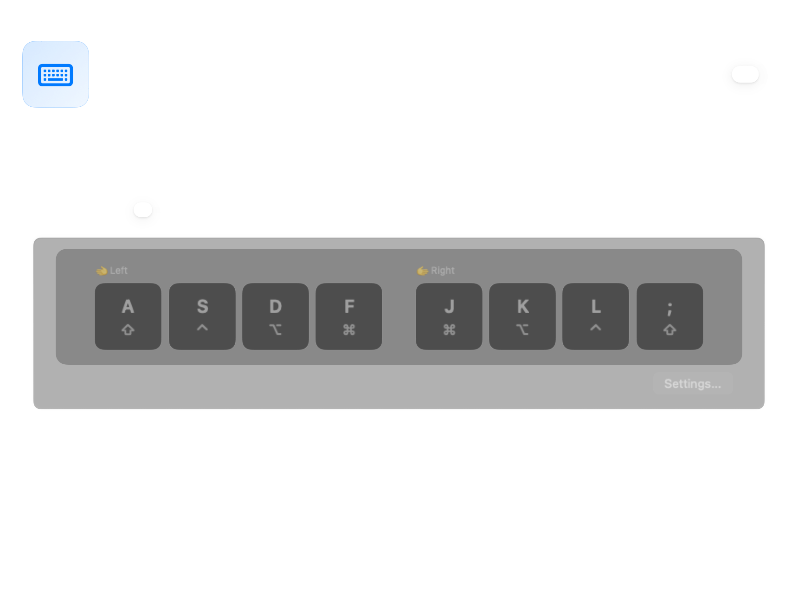
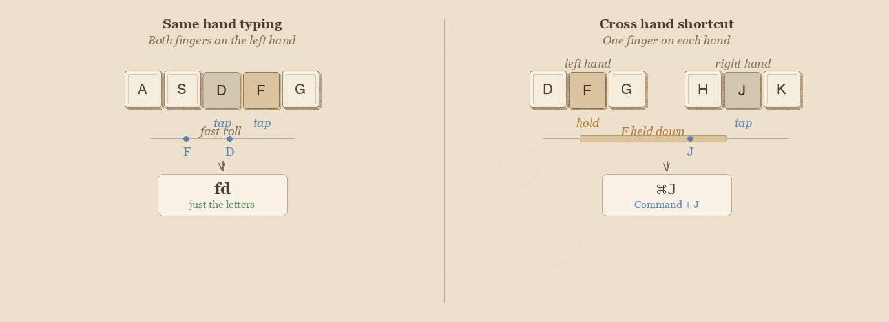

# Shortcuts Without Reaching

Every keyboard shortcut on your Mac requires a modifier — Command, Shift, Control, Option. Those keys are tucked into the bottom corners of your keyboard, forcing your fingers off the home row dozens of times an hour. Over a full workday, that's thousands of small reaches that slow you down and strain your hands.

Home row mods fix this by putting modifiers right under your fingertips. Tap a key normally and you get the letter. Hold it briefly and it becomes a modifier. Your hands never move — every shortcut is one fluid motion from the home row.

If you're new to keyboard customization, read [Keyboard Concepts](help:concepts) first for background on dual-role keys and layers.

---

## What are home row mods?

Every home row key gets a second job — tap for the letter, hold for a modifier. The layout is mirrored so both hands get the same modifiers:

**Left hand**

| Key | Tap | Hold |
|-----|-----|------|
| A | a | Shift ⇧ |
| S | s | Control ⌃ |
| D | d | Option ⌥ |
| F | f | Command ⌘ |

**Right hand**

| Key | Tap | Hold |
|-----|-----|------|
| J | j | Command ⌘ |
| K | k | Option ⌥ |
| L | l | Control ⌃ |
| ; | ; | Shift ⇧ |

The result: any keyboard shortcut is one fluid motion. Hold F + press C = ⌘C (Copy). Hold A + press Tab = ⇧Tab (Shift-Tab). No reaching, no contortion.

---

## Getting started

1. Open KeyPath and click the gear icon to open the inspector panel
2. Go to the **Custom Rules** tab
3. Enable the **Home Row Mods** pre-built rule
4. Start typing normally

The defaults are tuned to feel natural right away. KeyPath automatically detects same-hand typing rolls (like "fd" or "jk") and treats them as letters, not modifiers. It also suppresses modifiers during fast typing bursts. These protections mean misfires are rare out of the box — most users don't need to change any settings.

**Tip:** Start by using home row mods only for shortcuts you already know (⌘C, ⌘V, ⌘Z). Once those feel natural, expand to new shortcuts.

---

## Advanced settings

Once you're comfortable with the defaults, these settings let you fine-tune how home row mods feel. Open the Home Row Mods rule's settings to access these controls.

### Typing Feel

KeyPath provides a slider to adjust the tap-hold threshold:

<!-- screenshot: id="hrm-typing-feel-slider" method="snapshot" view="HomeRowTimingSection" state="slider:200ms" -->

- Slide toward **"More Letters"** for a longer tap window (fewer accidental modifiers)
- Slide toward **"More Modifiers"** for quicker modifier activation

*Start with defaults, then adjust one parameter at a time.*

### Opposite-hand activation

Hold actions (modifiers or layers) only activate when you press a key with the **other hand**. Same-hand typing always produces letters — no accidental modifiers during fast rolls.

This is enabled by default (**On Press**). The picker offers three modes:

- **Off** — Any key press can trigger the hold action (classic tap-hold behavior)
- **On Press** — Hold triggers when the other hand *presses* a key. Faster response, may misfire on fast same-hand rolls.
- **On Release** — Hold triggers when the other-hand key is *released*. More forgiving for fast typists.

### Fast typing protection

When you're typing quickly, the last thing you want is for "fd" to become Ctrl+D. Fast typing protection solves this: keys pressed shortly after your last keystroke produce the letter immediately — no hold detection, no waiting state.

<!-- screenshot: id="hrm-fast-typing" method="snapshot" view="HomeRowTimingSection" state="prior-idle:visible" -->

This is enabled by default at 150ms. Adjust the slider to match your typing speed — faster typists may want a lower value (strict), while slower typists can use a higher value (forgiving).

### Per-finger sensitivity

Pinkies are slower than index fingers. KeyPath lets you add extra tolerance for slower fingers to prevent accidental holds:

<!-- screenshot: id="hrm-per-finger-sliders" method="snapshot" view="HomeRowTimingSection" state="per-finger:visible" -->

### Quick tap

When enabled, a quick tap-and-release always produces the letter, even if another key was pressed during the tap window. This is especially helpful for fast typists who sometimes roll keys.

### Raw values

Click **# Raw values** in the timing header to see and edit the exact millisecond values for tap window and hold delay. Useful for precise tuning or matching values from a community config.

---

## Expert techniques

These are techniques being explored in the mechanical keyboard community. Some are in KeyPath today, others are planned or available through custom Kanata config.

### Anti-cascade / nomods layer

After a tap resolves, temporarily disable all home row mods for the rest of the typing burst, re-enabling them after a brief idle. This prevents chain-reaction misfires.

Pioneered by [Sunaku's home row mods configuration](https://sunaku.github.io/home-row-mods.html), which implements this via a dedicated "nomods" layer in Kanata.

### Typing streak detection

Track sustained typing bursts and suppress modifier activation entirely during the streak. Only re-enable modifiers after a pause. This eliminates nearly all misfires during fast prose typing.

See [Sunaku's bilateral combinations approach](https://sunaku.github.io/home-row-mods.html) for a detailed implementation.

### Achordion / Chordal Hold

QMK firmware libraries (created by [Pascal Getreuer](https://getreuer.info/posts/keyboards/home-row-mods/)) that make the tap/hold decision based on which hand pressed the next key. **Chordal Hold** was merged into QMK core in February 2025, making opposite-hand detection a built-in feature for QMK keyboards.

KeyPath's opposite-hand activation provides equivalent functionality for standard Mac keyboards via Kanata.

### Eager mods

Apply the modifier immediately while the tap-hold decision is still pending. If the key resolves as a tap, the modifier is retroactively canceled. This reduces perceived latency for intentional modifier use.

Kanata supports eager mode via `tap-hold-press` and `tap-hold-release` variants. See the [Kanata tap-hold documentation](https://github.com/jtroo/kanata/blob/main/docs/config.adoc#tap-hold) for details.

### Shift exemption

Shift is the most frequently used modifier during normal typing (capital letters, punctuation). Advanced configurations exempt Shift from streak suppression and anti-cascade so capitalization works naturally during fast typing, while still suppressing accidental Control, Option, and Command.

---

**Switching from Karabiner?** See the [From Karabiner-Elements guide](help:karabiner-users) for a detailed comparison of how home row mods work in both tools.

---

## Resources

### KeyPath guides

- **[Keyboard Concepts](help:concepts)** — Background on tap-hold, layers, and modifiers
- **[One Key, Multiple Actions](help:tap-hold)** — Detailed guide to all tap-hold options in KeyPath
- **[What You Can Build](help:use-cases)** — See HRM as part of a complete setup with Hyper key, window tiling, and more
- **[Alternative Layouts](help:alternative-layouts)** — HRM works with any layout — see what's supported
- **[Keyboard Layouts](help:keyboard-layouts)** — Split keyboards and HRM are a natural match
- **[Switching from Karabiner?](help:karabiner-users)** — See how KeyPath's HRM compares to Karabiner's approach
- **[Back to Docs](https://malpern.github.io/KeyPath/docs)**

### External references

- **[The Home Row Mods Guide (Precondition)](https://precondition.github.io/home-row-mods)** — The definitive community reference on HRM layouts and tuning ↗
- **[Pascal Getreuer's home row mods analysis](https://getreuer.info/posts/keyboards/home-row-mods/)** — Technical deep dive on timing, anti-misfire, and Chordal Hold ↗
- **[Sunaku's home row mods](https://sunaku.github.io/home-row-mods.html)** — Advanced anti-cascade and bilateral combinations ↗
- **[Kanata tap-hold documentation](https://github.com/jtroo/kanata/blob/main/docs/config.adoc#tap-hold)** — Full reference for the engine behind KeyPath's tap-hold ↗
- **[jtroo's Kanata config](https://github.com/jtroo/kanata/blob/main/cfg_samples/jtroo.kbd)** — Real-world advanced config from Kanata's creator ↗
- **[QMK Chordal Hold](https://docs.qmk.fm/features/chordal_hold)** — Firmware-level opposite-hand detection (same concept KeyPath uses) ↗
- **[r/ErgoMechKeyboards](https://www.reddit.com/r/ErgoMechKeyboards/)** — Active community discussing HRM tuning and experiences ↗
- **[Ben Vallack's HRM journey](https://www.youtube.com/@BenVallack)** — Practical experiences with home row mods on various layouts ↗
