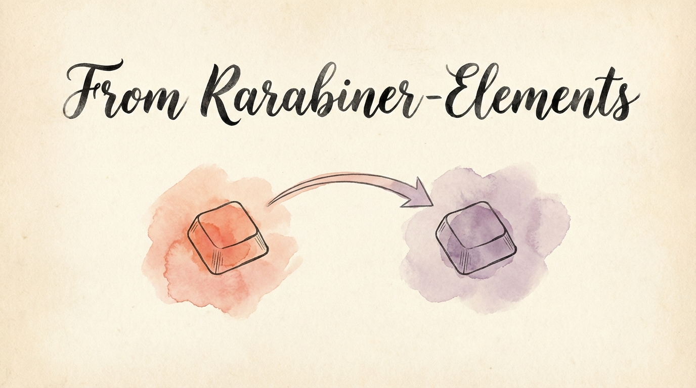

If you're using [Karabiner-Elements](https://karabiner-elements.pqrs.org/) and curious about KeyPath, this page maps the concepts you know to how KeyPath works — and helps you decide if switching makes sense.

---

## Why consider switching?

Karabiner-Elements is an excellent tool that pioneered keyboard remapping on macOS. KeyPath builds on that foundation with a different engine ([Kanata](https://github.com/jtroo/kanata)) that offers specific advantages:

| | Karabiner-Elements | KeyPath |
|---|---|---|
| **Config format** | JSON (verbose, complex) | Kanata S-expressions (concise) |
| **Tap-hold** | `to_if_alone` + timeout | 4 tap-hold variants, per-key tuning |
| **Home row mods** | Possible via complex JSON, global timeout, no misfire prevention | Built-in with split-hand detection, per-finger timing, anti-misfire |
| **Per-finger timing** | Global timeout only | Individual finger sensitivity |
| **Layers** | Separate rule sets | First-class `deflayer` with layer-switch |
| **App-specific** | Per-app rules via JSON | Automatic layer switching via TCP |
| **Configuration** | JSON editing or Karabiner UI | Visual UI + direct config editing |
| **Engine** | Custom C++ event tap | Kanata (Rust, purpose-built for tap-hold) |

**Karabiner's strengths** that KeyPath doesn't replicate:
- Massive [community rule library](https://ke-complex-modifications.pqrs.org/) with importable JSON rules
- Per-device targeting UI — apply different rules to each connected keyboard out of the box
- Longer track record (10+ years, widely trusted)
- Simpler mental model for basic remaps

---

## Concept mapping

Here's how Karabiner concepts translate to KeyPath/Kanata:

### Simple remaps

<div>

**KeyPath/Kanata:**
```lisp
(defsrc caps)
(deflayer base esc)
```

</div>

### Tap-hold (dual-role keys)

<div>

**KeyPath/Kanata:**
```lisp
(defalias
  caps (tap-hold 200 200 esc lctl)
)
(defsrc caps)
(deflayer base @caps)
```

</div>

Kanata's version is more concise and offers [4 tap-hold variants](help:tap-hold) with different activation strategies:
- `tap-hold` — pure timeout
- `tap-hold-press` — activates hold on other key press
- `tap-hold-release` — permissive hold, quick tap
- `tap-hold-release-keys` — specific keys trigger early activation

Read the [Tap-Hold guide](help:tap-hold) for details on each variant.

### Layers

<div>

**KeyPath/Kanata:** Layers are a first-class concept:
```lisp
(deflayer base
  @nav  a  s  d  f
)
(deflayer nav
  _     ←  ↓  ↑  →
)
```

</div>

### Complex modifications

Karabiner's [Complex Modifications](https://ke-complex-modifications.pqrs.org/) are powerful JSON rules. In KeyPath, equivalent functionality uses Kanata's `defalias`, `multi`, `switch`, and `defseq`:

```lisp
;; Hyper key (equivalent to Karabiner complex modification)
(defalias
  hyp (tap-hold 200 200 esc (multi lctl lalt lmet lsft))
)

;; Leader key sequence
(defseq
  open-safari (spc s s)
  open-terminal (spc s t)
)
```

### App-specific rules

<div>

**KeyPath:** Automatic layer switching. Add an app in the App-Specific Rules tab, configure mappings, and KeyPath switches layers via TCP when you switch apps. See the [Window Management guide](help:window-management).

</div>

---

## What you'll gain

- **Better tap-hold** — Kanata offers four tap-hold variants with per-key timing, giving you more control over dual-role key behavior. See [Home Row Mods](help:home-row-mods).
- **Split-hand detection** — Cross-hand keypresses activate modifiers, same-hand keypresses produce letters. This reduces home row mod misfires significantly.
- **Readable config** — A typical remap takes 3 lines of Kanata vs 20+ lines of Karabiner JSON.
- **App launching** — Built-in [Action URI system](help:action-uri) for launching apps, opening URLs, and tiling windows from your keyboard.
- **Visual configuration** — KeyPath's UI lets you configure without editing JSON or config files directly.

## What you'll lose (temporarily)

- **Community rule library** — Karabiner's [importable modifications](https://ke-complex-modifications.pqrs.org/) library has thousands of user-contributed rules. KeyPath ships with 16 built-in rule collections (Vim Navigation, Home Row Mods, Window Snapping, Quick Launcher, etc.) but doesn't yet support importing community-shared packs. Interested in a Karabiner rule import tool? Let us know in [GitHub Discussions](https://github.com/malpern/KeyPath/discussions) so we can prioritize it.
- **Some edge-case rules** — Karabiner's JSON is extremely flexible. Some exotic conditions (mouse button combinations, device-specific vendor IDs with complex conditions) may require creative workarounds in Kanata.
- **Track record** — Karabiner has been trusted for 10+ years. KeyPath is newer. Both are open source, so you can verify the code yourself.

---

## Can I run both?

**Not simultaneously.** Both tools intercept keyboard events at the system level, and running two event interceptors causes conflicts (dropped keys, double-presses, system instability). You should fully disable or uninstall Karabiner before using KeyPath.

KeyPath's installer wizard will detect running Karabiner processes and warn you if there's a conflict.

**Note:** KeyPath uses the same [Karabiner VirtualHIDDevice driver](https://github.com/pqrs-org/Karabiner-DriverKit-VirtualHIDDevice) for its virtual keyboard. If you already have Karabiner installed, this driver is already present and approved.

---

## Migration steps

### 1. Document your current setup

Before uninstalling Karabiner, export or screenshot your rules:

```bash
# Your Karabiner config is at:
cat ~/.config/karabiner/karabiner.json

# Or copy it somewhere safe:
cp ~/.config/karabiner/karabiner.json ~/Desktop/karabiner-backup.json
```

### 2. Install KeyPath

Follow the [Installation guide](https://keypath-app.com/getting-started/installation). KeyPath's wizard handles permissions and driver setup.

### 3. Quit Karabiner

Quit Karabiner-Elements from its menu bar icon, or:

```bash
# Quit Karabiner
osascript -e 'quit app "Karabiner-Elements"'

# Optionally stop the daemon
launchctl bootout system/org.pqrs.karabiner.karabiner_grabber 2>/dev/null
```

### 4. Recreate your rules

Start with the basics — remaps you use most — and build up:

1. **Caps Lock remap** — Enable the pre-built rule in KeyPath
2. **Home row mods** — Enable the pre-built rule (much easier than the Karabiner JSON version)
3. **Custom rules** — Recreate your most-used modifications one at a time

See [Your First Mapping](https://keypath-app.com/getting-started/first-mapping) for a walkthrough.

### 5. Fine-tune

KeyPath's per-finger timing and split-hand detection may mean you need less tweaking than your Karabiner setup required. Start with defaults and adjust from there.

---

## Common Karabiner rules → KeyPath equivalents

| Karabiner Rule | KeyPath Equivalent |
|---|---|
| Caps Lock → Escape | Pre-built "Caps Lock Remap" rule |
| Caps Lock → Escape/Control | Pre-built rule with tap-hold |
| Caps Lock → Hyper | Pre-built "Caps Lock Remap" → Hyper mode |
| Home row mods | Pre-built "Home Row Mods" rule |
| Vi-style arrows (HJKL) | Custom rule or [Vim Navigation](help:use-cases#vim-navigation-everywhere) |
| App-specific shortcuts | App-Specific Rules tab |
| Launch apps from keyboard | [Action URI system](help:action-uri) |
| Window snapping | [Window Management](help:window-management) |

---

## Karabiner feature parity

Not every Karabiner feature has a direct KeyPath equivalent yet. Here's the current state:

| Karabiner Feature | KeyPath Status | Notes |
|---|---|---|
| Simple remaps | **Full support** | `defsrc` / `deflayer` |
| Tap-hold / `to_if_alone` | **Full support** | 4 variants, more control than Karabiner |
| Layers | **Full support** | First-class `deflayer` with `layer-switch` / `layer-toggle` |
| App-specific rules | **Full support** | Automatic layer switching via TCP |
| Simultaneous key combos | **Full support** | Kanata `chord` action |
| Mouse button remapping | **Partial** | Kanata supports mouse keys, but Karabiner's mouse button conditions are more flexible |
| Device-specific rules | **Partial** | Kanata's `device-if` works in raw config, but no UI yet (see [#203](https://github.com/malpern/KeyPath/issues/203)) |
| Complex variable conditions | **Partial** | Kanata's `switch` action covers most cases, but some multi-variable conditions need restructuring |
| Profile switching | **Not yet** | Karabiner lets you switch between profiles; KeyPath uses a single config with layers |
| Community rule import | **Partial** | 16 built-in collections, but no community sharing or import yet (Karabiner has [thousands](https://ke-complex-modifications.pqrs.org/)) |
| Pointing device rules | **Limited** | Kanata has mouse key support but not Karabiner's full pointing device condition system |

### Config converter (future)

We're exploring a tool that would let you paste your Karabiner JSON and see the equivalent Kanata config — making migration near-instant for common patterns. If this would be useful to you, let us know in [GitHub Discussions](https://github.com/malpern/KeyPath/discussions) so we can prioritize it.

---

## Further reading

- **[Keyboard Concepts](help:concepts)** — If you want a refresher on the fundamentals
- **[Home Row Mods](help:home-row-mods)** — Where KeyPath really shines
- **[Tap-Hold & Tap-Dance](help:tap-hold)** — All four tap-hold variants explained
- **[What You Can Build](help:use-cases)** — Concrete examples of KeyPath setups
- **[Action URIs](help:action-uri)** — Launch apps, URLs, and window actions
- **[Privacy & Permissions](help:privacy)** — How KeyPath's permission model compares
- **[Karabiner-Elements](https://karabiner-elements.pqrs.org/)** — Karabiner's official site ↗
- **[Complex Modifications](https://ke-complex-modifications.pqrs.org/)** — Karabiner's community rule library ↗
- **[Back to Docs](https://keypath-app.com/docs)**
