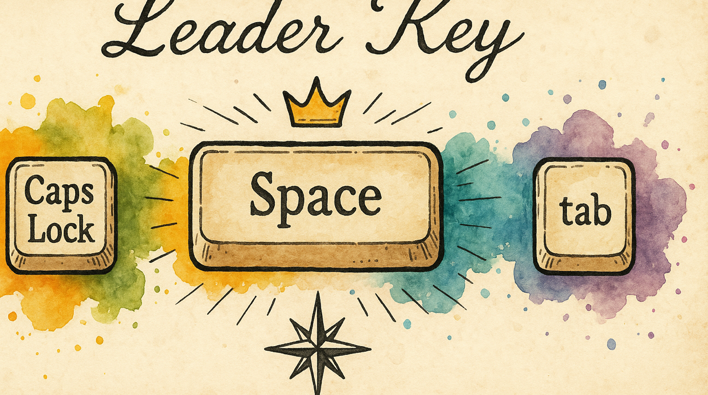

# Choose Your Leader Key

Every layer in KeyPath — navigation, numpad, symbols, function keys, window snapping — activates through one key: your Leader. By default it's Space. But if Space doesn't feel right, you can switch to Caps Lock, Tab, or Backtick. One change here updates every layer at once.

---

## What Is the Leader Key?

The Leader key is the single key you hold to enter the navigation layer. From there, you either use navigation directly (H/J/K/L for arrows) or press a second key to reach a deeper layer (S for symbols, F for function keys, ; for numpad).

Think of it as the front door to all your keyboard shortcuts. Every layer pack that says "Hold Space →" is really saying "Hold your Leader key →."

---

## Your Options

| Key | Why you'd pick it |
|-----|-------------------|
| **␣ Space** (default) | Easiest thumb access. Tap for space, hold for layers. Most people start here. |
| **⇪ Caps Lock** | Dedicated modifier — no conflict with typing. Great if you never use Caps Lock anyway. |
| **⇥ Tab** | Left pinky access. Tap for Tab, hold for layers. Good for Vim users who want Space untouched. |
| **` Backtick** | Upper-left corner. Rarely used in normal typing. Tap for backtick, hold for layers. |

---

## Changing It

1. Open KeyPath and click the gear icon to open the inspector panel
2. Go to the **Rules** tab
3. Find **Leader Key** in the list (look for the hand icon)
4. Select your preferred key from the picker

The change takes effect immediately — all layers that use the Leader key update automatically. No need to individually reconfigure each pack.

---

## How It Affects Other Packs

The Leader key setting is global. Changing it from Space to Caps Lock means:

- **Vim Navigation**: Hold Caps Lock + H/J/K/L for arrows (instead of Space)
- **Window Snapping**: Hold Caps Lock → W → window actions
- **Numpad**: Hold Caps Lock → ; → number entry
- **Symbol**: Hold Caps Lock → S → programming symbols
- **Function**: Hold Caps Lock → F → F-keys and media
- **Delete Enhancement**: Hold Caps Lock + Delete for forward-delete
- **Mission Control**: Hold Caps Lock → shortcuts for Exposé, desktops

---

## Which Should You Pick?

### Space (default) — best for most people

Pros: Your strongest finger (thumb) does the work. Natural to hold while other fingers move.

Cons: Adds a tiny delay to typing spaces (the tap/hold threshold). Most people don't notice after a day.

### Caps Lock — best if you've already remapped it

Pros: Zero conflict with typing. Feels natural if you're used to Caps Lock as a modifier (Ctrl or Hyper). Dedicated key that you never accidentally press.

Cons: Left pinky does all the work. Slightly less ergonomic for extended layer use.

### Tab — best for Vim purists

Pros: Keeps Space completely normal. Left hand activates, right hand navigates. Familiar if you've used Leader in Vim/Neovim.

Cons: Tab key now needs a tap/hold distinction. Can conflict with tab-completion in some apps.

### Backtick — best for minimal disruption

Pros: Rarely used in normal typing (markdown/code aside). No conflict with common shortcuts.

Cons: Awkward reach from the home row. You'll need to hold an unusual key.

---

## Combining with Caps Lock Remap

If you set Leader to **Caps Lock**, you probably also want the **Caps Lock Remap** pack configured with a tap action (like Escape or Backspace). That way:

- **Tap Caps Lock** → Escape (or your chosen action)
- **Hold Caps Lock** → Leader key (activates all layers)

This is the "Caps Lock does everything" setup that many keyboard enthusiasts use.

---

## Troubleshooting

### Changing the Leader doesn't seem to work

1. Make sure the Leader Key pack is **enabled** (toggled on)
2. Verify KeyPath's service reloaded (check for the green indicator)
3. Try disabling and re-enabling one of the dependent packs (like Vim Navigation)

### Space feels laggy after enabling

The tap/hold threshold (default 180ms) determines how long you must hold before it's a "hold" vs. a "tap." If typing feels sluggish:
- Practice releasing Space quickly between words
- The threshold is tuned for most typists — give it a day before adjusting

### I want a key that's not in the list

Currently the four options (Space, Caps Lock, Tab, Backtick) are the supported leaders. These were chosen for ergonomics and compatibility with the layer system.

---

## Next Steps

- **[Navigate Text Like a Keyboard Ninja](help:vim-navigation)** — The foundation layer that Leader activates
- **[Shortcuts Without Reaching](help:home-row-mods)** — Combine Leader layers with home row modifiers
- **[Keyboard Concepts](help:concepts)** — Background on layers and momentary activation
- **[Back to Docs](https://malpern.github.io/KeyPath/docs)**
