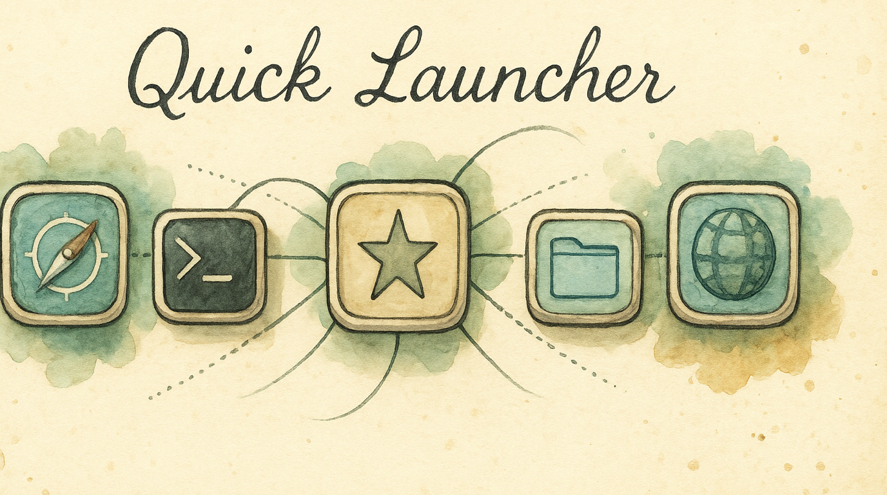

# Launch Anything With One Keystroke

You're in the middle of typing and need to jump to Safari, or open a URL, or fire up Terminal. Normally that means reaching for the Dock, Spotlight, or a launcher app — breaking your flow. With the Quick Launcher, you hold one key and press a letter. App opens instantly. Hands never leave the keyboard.

---

## What You Get

Enable the **Quick Launcher** pack and you get a dedicated launcher layer on your keyboard:

- **Hold Hyper + press a letter** → launch the assigned app, URL, folder, or script
- **Visual overlay** → the keyboard overlay shows app icons on mapped keys so you always know what's where
- **Instant dismiss** → release Hyper and you're back to typing

Default mappings ship ready to use: **S** = Safari, **T** = Terminal, **F** = Finder, **G** = GitHub. Customize from there.

---

## Enabling It

1. Open KeyPath and click the gear icon to open the inspector panel
2. Go to the **Rules** tab
3. Find **Quick Launcher** in the Productivity section
4. Toggle it **on**

The Quick Launcher uses the **Hyper key** (all four modifiers at once). If you haven't set up a Hyper key yet, enable the **Caps Lock Remap** pack first — it turns Caps Lock hold into Hyper.

---

## How It Works

1. **Hold the Hyper key** (default: hold Caps Lock)
2. The overlay switches to show your launcher mappings — each key displays the icon of its assigned app or action
3. **Press a letter** to launch that app/URL/folder
4. Release Hyper — you're back to normal typing

Unmapped keys appear dimmed. The overlay disappears automatically after you launch something.

---

## Configuring Your Launcher

### Adding a mapping

1. In the Quick Launcher pack detail view, click any empty key on the keyboard visualization
2. Choose what to assign:
   - **App** — pick from installed applications
   - **URL** — enter a web address (opens in default browser)
   - **Folder** — pick a folder to open in Finder
   - **Script** — select a script to execute
3. The key now shows the app icon on the overlay

### Removing or changing a mapping

Click any mapped key in the visualization to reassign or clear it.

### Activation modes

The Quick Launcher supports two trigger styles:

| Mode | How it works |
|------|-------------|
| **Hyper Hold** (default) | Hold Hyper key, press a letter, release Hyper |
| **Hyper Tap** | Tap Hyper to toggle the launcher layer on/off, then press a letter |

Change the activation mode in the pack settings.

---

## Tips

- Keys are suggested in home-row-first order for ergonomics — start with the home row and work outward
- You can map any letter (a–z), number (0–9), or punctuation key
- The **"Suggest from History"** button scans your browser history and suggests frequently-visited sites to map
- Quick Launcher works alongside all other KeyPath features — your home row mods, app-specific rules, and tap-hold keys all coexist

---

## Troubleshooting

### Nothing happens when I press Hyper + a key

1. Verify the Quick Launcher pack is enabled (check the Rules tab)
2. Verify your Hyper key is working — the overlay should show "✦" on Caps Lock when held
3. Check that the key you're pressing has a mapping assigned

### The overlay doesn't appear

1. Make sure the overlay isn't hidden (check the menu bar icon)
2. Check that KeyPath's service is running (green indicator in the overlay header)

---

## Next Steps

- **[Launching Apps & Workflows](help:action-uri)** — The full action URI system for power users (scripts, window tiling, deep links)
- **[Keyboard Concepts](help:concepts)** — Background on the Hyper key and layers
- **[What You Can Build](help:use-cases)** — See the Quick Launcher as part of a complete keyboard workflow
- **[One Key, Multiple Actions](help:tap-hold)** — Fine-tune the Hyper key's tap vs. hold behavior
- **[Back to Docs](https://malpern.github.io/KeyPath/docs)**
