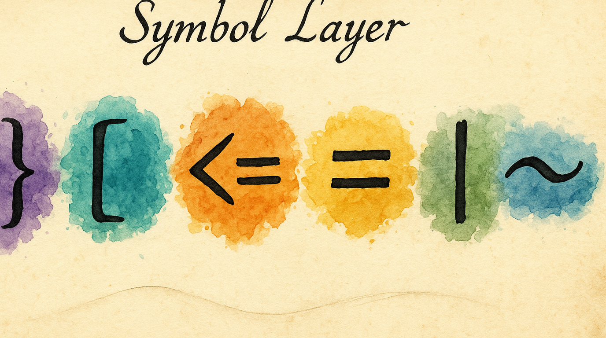

# Programming Symbols at Your Fingertips

Brackets, pipes, tildes, angle brackets — the symbols you type hundreds of times a day in code are scattered across the keyboard behind Shift reaches and awkward pinky stretches. The Symbol layer puts them all under your home row, organized by how you actually use them.

---

## What You Get

Enable the **Symbol** pack and you gain a dedicated symbol layer with three preset layouts to choose from:

- **Mirrored** (default) — Shifted number-row symbols in the same positions, plus operators and brackets on the home row
- **Paired Brackets** — Opening brackets on the left hand, closing on the right. Visual symmetry.
- **Programmer** — Common coding bigrams (→, !=, <=) as comfortable rolls

Each preset maps 20–29 keys. Pick the one that matches how you think about symbols.

---

## Enabling It

1. Open KeyPath and click the gear icon to open the inspector panel
2. Go to the **Rules** tab
3. Find **Symbol** in the Layers section
4. Toggle it **on**
5. Choose a preset from the layout picker

Requires **Vim Navigation** (or another Leader pack) to be enabled.

---

## How to Activate

Two-step activation:

1. **Hold your Leader key** (Space by default) — enters the navigation layer
2. **While holding Leader, press S** — enters the symbol layer
3. **Press symbol keys** — types brackets, operators, etc.
4. **Release Leader** — back to normal typing

The **S** activator was chosen as a mnemonic for "Symbols."

---

## The Presets

### Mirrored (default)

Easiest to learn — shifted symbols stay in their number-row positions:

**Top row:** ! @ # $ % ^ & * ( )
**Home row:** ~ ` - = + [ ] { } |
**Bottom row:** \ _ / ? ' " : < >

The mental model: "my keyboard, but everything is shifted."

### Paired Brackets

Designed for code where brackets come in matched pairs:

**Left hand (opening):** { ( [ < - | + _ / \
**Right hand (closing):** % ^ & * ` = > ] ) }

The mental model: "left hand opens, right hand closes."

### Programmer

Optimized for typing common code patterns:

**Home row:** { ( [ < = - > ] ) }

The `<`, `=`, `-`, `>` cluster on F-G-H-J lets you roll common bigrams like `->`, `=>`, `<=`, and `!=` as comfortable finger rolls.

---

## Choosing a Preset

| If you… | Try… |
|---------|------|
| Want the easiest learning curve | Mirrored |
| Write lots of nested brackets (JSON, Lisp, HTML) | Paired Brackets |
| Write Go, Rust, TypeScript, or arrow-heavy code | Programmer |

You can switch presets any time — the change takes effect immediately.

---

## Tips

- **Start with Mirrored** if you're unsure. It's the most intuitive because symbols stay where you expect them.
- The symbol layer works alongside Home Row Mods — you can hold Shift (via D key) to get uppercase variants while in the symbol layer
- **Practice in a scratchpad** — open TextEdit and type some code constructs using the layer. Muscle memory develops in a few days.
- Two-step activation (Leader → S) sounds complex but becomes as automatic as Shift+key

---

## Troubleshooting

### Wrong symbols appear

Check which preset is selected. Each preset has a very different layout. Look at the overlay to see the current mapping.

### Leader → S doesn't activate the layer

1. Make sure the Symbol pack is **enabled**
2. Verify **Vim Navigation** is enabled (provides the Leader layer)
3. Hold Leader the entire time — don't release between steps

### I want to customize individual key assignments

The current version uses preset layouts. Custom per-key symbol mapping is planned for a future update.

---

## Next Steps

- **[Navigate Text Like a Keyboard Ninja](help:vim-navigation)** — The foundation layer (required for symbols)
- **[Choose Your Leader Key](help:leader-key)** — Change which key starts the activation
- **[Symbols Without Shift](help:auto-shift)** — An alternative approach: hold symbol keys longer for shifted variants
- **[Keyboard Concepts](help:concepts)** — Background on layers and presets
- **[Back to Docs](https://malpern.github.io/KeyPath/docs)**
