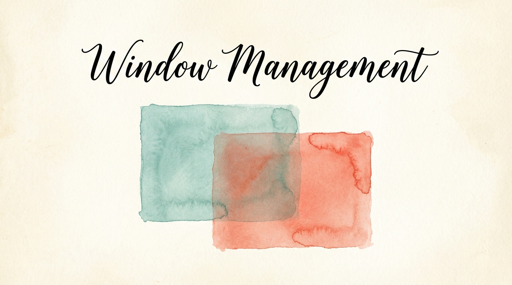

# Window Management & App-Specific Shortcuts

Dragging windows with a mouse breaks your flow. So does remembering which keyboard shortcuts work in which app. KeyPath solves both: **tile windows with a keystroke**, and **let your keyboard adapt automatically** when you switch apps.

Different apps need different shortcuts — Vim-style navigation in your browser, custom bindings in your editor, different layers in Terminal. KeyPath detects which app is in front and switches your key mappings to match. No manual toggling.

---

## App-Specific Keymaps

Create different keyboard layouts for different apps. For example:
- Vim-style navigation in Safari
- Custom shortcuts in VS Code
- Different layer behavior in Terminal

### Creating App-Specific Rules

1. Open KeyPath and click the gear icon to open the inspector panel
2. Go to the **Custom Rules** tab
3. Click **New Rule** (+ button)
4. Select an application from the app picker — KeyPath shows all installed apps
5. Add key mappings for that app (e.g., `H` → `Left Arrow`)
6. Click **Save**

<!-- screenshot: id="window-mgmt-custom-rules" method="snapshot" view="CustomRulesTabView" state="rules:app-specific,apps:safari+terminal" -->
Screenshot — Custom Rules tab showing app-specific rule cards:
```
  ┌─────────────────────────────────────────────────────┐
  │  Custom Rules                                       │
  │                                                     │
  │  ┌────────────────────────────────────────────────┐ │
  │  │  EVERYWHERE (global rules)                     │ │
  │  │  caps_lock ──→ escape                          │ │
  │  └────────────────────────────────────────────────┘ │
  │                                                     │
  │  ┌────────────────────────────────────────────────┐ │
  │  │  🧭 SAFARI                            [✏] [🗑] │ │
  │  │                                                │ │
  │  │  h ──→ left_arrow                              │ │
  │  │  j ──→ down_arrow                              │ │
  │  │  k ──→ up_arrow                                │ │
  │  │  l ──→ right_arrow                             │ │
  │  └────────────────────────────────────────────────┘ │
  │                                                     │
  │  ┌────────────────────────────────────────────────┐ │
  │  │  💻 TERMINAL                          [✏] [🗑] │ │
  │  │                                                │ │
  │  │  (layer switch: vim-nav)                       │ │
  │  └────────────────────────────────────────────────┘ │
  │                                                     │
  │  [ ↺ Reset ]                     [ + New Rule ]     │
  └─────────────────────────────────────────────────────┘
```

KeyPath handles everything behind the scenes: it generates virtual keys, sets up layer switching, and communicates with the remapping engine via TCP. You don't need to edit any configuration files.

---

## How It Works

When you create app-specific rules in the UI, KeyPath:

1. **Detects app switches** — monitors which app is in the foreground
2. **Sends layer commands** — tells the remapping engine to switch layers automatically
3. **Restores defaults** — when you switch away, your normal key mappings return

All of this happens instantly and invisibly. You just switch apps and your keyboard adapts.

---

## Example: Vim Navigation in Safari

A popular setup: use HJKL as arrow keys in Safari for keyboard-driven browsing.

1. Go to the **Custom Rules** tab
2. Click **New Rule** and select **Safari** as the target app
3. Add these mappings:
   - `H` → `Left Arrow`
   - `J` → `Down Arrow`
   - `K` → `Up Arrow`
   - `L` → `Right Arrow`
4. Click **Save**

Now when Safari is active, HJKL works as arrow keys. Switch to any other app and they go back to normal letters — no manual toggling needed.

---

## Window Snapping

KeyPath includes built-in window snapping shortcuts. Enable the **Window Snapping** pre-built rule to get:

- **Hyper + H** → Snap window to left half
- **Hyper + L** → Snap window to right half
- **Hyper + K** → Maximize window
- **Hyper + J** → Center window
- **Hyper + U/I/N/M** → Snap to corners

These use KeyPath's [Launching Apps & Workflows](help:action-uri) under the hood. You can also trigger window actions from external tools like Raycast or Alfred:

```bash
open "keypath://window/snap/left"
```

---

## Troubleshooting

### App-specific rules not working

1. Verify the app appears in your app-specific rules list
2. Check that KeyPath's service is running (look for the green status indicator)
3. Try switching away from the app and back
4. Check **File → View Logs** for connection errors

### Rules apply to wrong app

1. Verify the bundle identifier is correct in the rules list
2. Check for apps with similar names
3. Remove and re-add the app to refresh the bundle identifier

---

## Best Practices

1. **Start simple** — Add one app at a time and test before adding more
2. **Test thoroughly** — Switch between apps to verify rules activate and deactivate correctly
3. **Use familiar patterns** — Map keys in ways that match the app's existing shortcuts (e.g., Vim keys for browsers)
4. **Combine with other features** — App-specific rules work great alongside [Shortcuts Without Reaching](help:home-row-mods) and [Hyper key](help:use-cases) setups

---

## Next Steps

- **[Launching Apps & Workflows](help:action-uri)** — Full reference for all URI actions including window snapping
- **[What You Can Build](help:use-cases)** — See window tiling as part of a complete setup
- **[Keyboard Concepts](help:concepts)** — Background on layers and modifiers
- **[One Key, Multiple Actions](help:tap-hold)** — Configure the keys that trigger your window actions
- **[Shortcuts Without Reaching](help:home-row-mods)** — Combine window management with home row modifiers
- **[Switching from Karabiner?](help:karabiner-users)** — Map your existing Karabiner window rules to KeyPath
- **[Back to Docs](https://keypath-app.com)** — See all available guides

## External resources

- **[Rectangle](https://rectangleapp.com/)** — Dedicated window manager that pairs well with KeyPath shortcuts ↗
- **[Raycast Window Management](https://www.raycast.com/extensions/window-management)** — Raycast's built-in window tiling ↗
- **[Kanata configuration reference](https://github.com/jtroo/kanata/blob/main/docs/config.adoc)** — Full reference for advanced users who want to edit configs directly ↗
