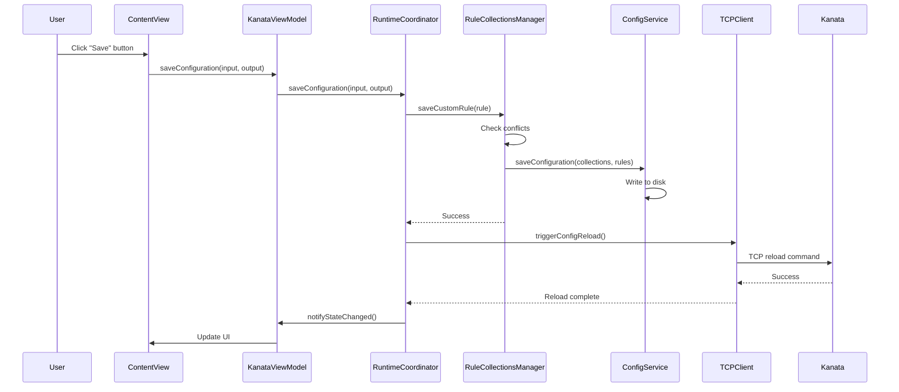
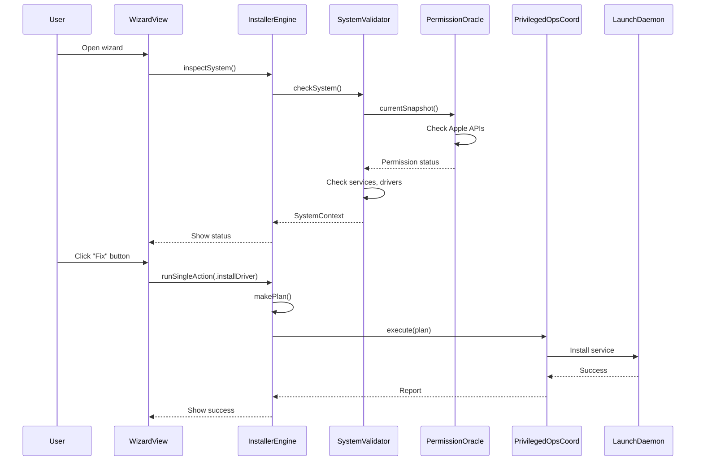

# KeyPath Architecture Diagram

**Purpose:** Visual guide to component relationships and data flow.  
**Last Updated:** November 2025

**Note:** Some components (e.g., RuleCollectionsManager) are R2 features. R1 includes Custom Rules, InstallerEngine, PermissionOracle, and RuntimeCoordinator.

---

## System Overview

```mermaid
graph TB
    subgraph "UI Layer (SwiftUI)"
        ContentView[ContentView]
        WizardView[InstallationWizardView]
        SettingsView[SettingsView]
    end

    subgraph "ViewModel Layer (MVVM)"
        KanataViewModel[KanataViewModel<br/>@Published properties]
    end

    subgraph "Coordination Layer"
        RuntimeCoordinator[RuntimeCoordinator<br/>~1,826 lines<br/>Main orchestrator]
        InstallerEngine[InstallerEngine<br/>Installation façade]
        PrivilegedOpsCoord[PrivilegedOperationsCoordinator<br/>Admin operations]
    end

    subgraph "Service Layer"
        RuleCollectionsMgr[RuleCollectionsManager<br/>Rule management]
        SystemReqChecker[SystemRequirementsChecker<br/>System checks]
        ConfigService[ConfigurationService<br/>File I/O]
        KanataService[KanataService<br/>Process lifecycle]
        PermissionOracle[PermissionOracle<br/>Permission detection]
        DiagnosticsService[DiagnosticsService<br/>Error analysis]
    end

    subgraph "System Integration"
        ProcessLifecycleMgr[ProcessLifecycleManager<br/>PID tracking]
        KarabinerConflictSvc[KarabinerConflictService<br/>Conflict detection]
        TCPClient[TCPEngineClient<br/>Kanata communication]
    end

    subgraph "System Components"
        LaunchDaemon[LaunchDaemon<br/>com.keypath.kanata]
        VHIDDriver[VirtualHID Driver<br/>Karabiner]
        SystemSettings[System Settings<br/>TCC Permissions]
    end

    %% UI → ViewModel
    ContentView --> KanataViewModel
    WizardView --> KanataViewModel
    SettingsView --> KanataViewModel

    %% ViewModel → Coordinator
    KanataViewModel --> RuntimeCoordinator
    KanataViewModel --> InstallerEngine

    %% Coordinator → Services
    RuntimeCoordinator --> RuleCollectionsMgr
    RuntimeCoordinator --> SystemReqChecker
    RuntimeCoordinator --> ConfigService
    RuntimeCoordinator --> KanataService
    RuntimeCoordinator --> PermissionOracle
    RuntimeCoordinator --> DiagnosticsService
    RuntimeCoordinator --> ProcessLifecycleMgr
    RuntimeCoordinator --> KarabinerConflictSvc
    RuntimeCoordinator --> TCPClient

    %% InstallerEngine → Services
    InstallerEngine --> SystemReqChecker
    InstallerEngine --> PrivilegedOpsCoord
    InstallerEngine --> ProcessLifecycleMgr

    %% Services → System
    KanataService --> LaunchDaemon
    TCPClient --> LaunchDaemon
    SystemReqChecker --> SystemSettings
    PrivilegedOpsCoord --> LaunchDaemon
    KarabinerConflictSvc --> VHIDDriver

    %% PermissionOracle → System
    PermissionOracle --> SystemSettings

    style RuntimeCoordinator fill:#e1f5ff
    style InstallerEngine fill:#fff4e1
    style PermissionOracle fill:#ffe1f5
    style RuleCollectionsMgr fill:#e1ffe1
    style SystemReqChecker fill:#e1ffe1
```

---

## Data Flow: User Creates Key Mapping



---

## Data Flow: Installation Wizard



---

## Component Responsibilities

### UI Layer
- **ContentView**: Main app window, key mapping UI
- **InstallationWizardView**: Setup wizard with status checks
- **SettingsView**: App preferences

### ViewModel Layer
- **KanataViewModel**: SwiftUI reactivity, @Published properties, delegates to RuntimeCoordinator

### Coordination Layer
- **RuntimeCoordinator**: Main orchestrator (~1,826 lines)
  - Coordinates all services
  - Manages UI state snapshots
  - Handles lifecycle operations
- **InstallerEngine**: Installation/repair façade
  - `inspectSystem()` → `makePlan()` → `execute()`
  - Recipe-based execution
- **PrivilegedOperationsCoordinator**: Admin operations
  - Routes to XPC helper (release) or sudo (debug)

### Service Layer
- **RuleCollectionsManager**: Rule collections & custom rules (R2 feature)
  - Conflict detection
  - Layer monitoring
  - Config regeneration
  - **Note:** Rule Collections are R2-only. R1 includes Custom Rules only.
- **SystemRequirementsChecker**: System status checks
  - Installation detection
  - Permission checking
  - Karabiner status
  - Settings opening
- **ConfigurationService**: Config file I/O
  - Reading/writing Kanata configs
  - Validation
  - Parsing
- **KanataService**: Process lifecycle
  - Start/stop/restart
  - Health monitoring
- **PermissionOracle**: Single source of truth for permissions
  - Apple API checks (authoritative)
  - TCC fallback (when needed)
  - Caching (1.5s TTL)
- **DiagnosticsService**: Error analysis
  - Log parsing
  - Failure diagnosis
  - Diagnostic generation

### System Integration
- **ProcessLifecycleManager**: PID tracking, conflict detection
- **KarabinerConflictService**: Karabiner Elements detection/resolution
- **TCPEngineClient**: Communication with Kanata daemon

---

## Key Architectural Patterns

### 1. MVVM Separation
- **Views** never access RuntimeCoordinator directly
- **ViewModel** holds @Published properties for SwiftUI
- **RuntimeCoordinator** provides `getCurrentUIState()` snapshots

### 2. Façade Pattern (InstallerEngine)
- Unified API for installation/repair
- Hides complexity of recipe system
- Backward-compatible with legacy code

### 3. Single Source of Truth (PermissionOracle)
- All permission checks go through Oracle
- Apple APIs take precedence over TCC
- Cached results for performance

### 4. Service Extraction
- Focused services with single responsibilities
- RuleCollectionsManager: ~406 lines
- SystemRequirementsChecker: ~292 lines
- Reduces RuntimeCoordinator complexity

---

## Entry Points for Common Tasks

### Add a Key Mapping
```
ContentView → KanataViewModel.saveConfiguration() 
→ RuntimeCoordinator.saveConfiguration() 
→ RuleCollectionsManager.saveCustomRule() 
→ ConfigService.saveConfiguration()
```

### Check System Status
```
WizardView → InstallerEngine.inspectSystem() 
→ SystemValidator.checkSystem() 
→ PermissionOracle.currentSnapshot()
```

### Start Kanata Service
```
KanataViewModel.startKanata() 
→ RuntimeCoordinator.startKanata() 
→ KanataService.start() 
→ LaunchDaemon bootstrap
```

---

## File Organization

```
Sources/KeyPathAppKit/
├── Managers/
│   ├── RuntimeCoordinator.swift (~1,826 lines)
│   ├── RuntimeCoordinator+Configuration.swift
│   ├── RuntimeCoordinator+Lifecycle.swift
│   └── ...
├── Services/
│   ├── RuleCollectionsManager.swift (~406 lines)
│   ├── SystemRequirementsChecker.swift (~292 lines)
│   ├── ConfigurationService.swift
│   ├── KanataService.swift
│   ├── PermissionOracle.swift (in KeyPathPermissions/)
│   └── ...
├── InstallationWizard/
│   ├── Core/
│   │   ├── InstallerEngine.swift
│   │   └── SystemValidator.swift
│   └── UI/
└── UI/
    ├── ContentView.swift
    ├── ViewModels/
    │   └── KanataViewModel.swift
    └── ...
```

---

## Recent Refactoring Progress

**RuntimeCoordinator Size Reduction:**
- **Before:** 2,600 lines total (2,284 main + extensions)
- **After:** 2,142 lines total (1,826 main + extensions)
- **Reduction:** 458 lines extracted (~18%)

**Extracted Services:**
- ✅ RuleCollectionsManager (406 lines)
- ✅ SystemRequirementsChecker (292 lines)

**Target:** Continue reducing RuntimeCoordinator to ~800 lines by extracting more focused services.

