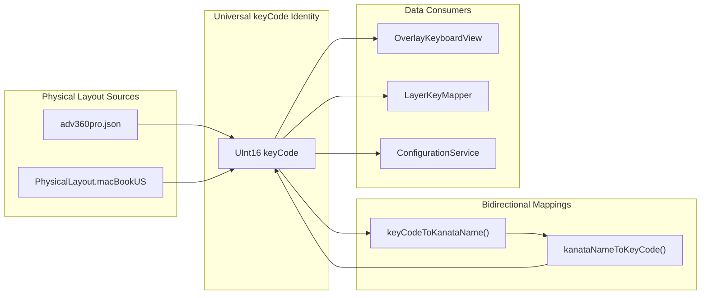
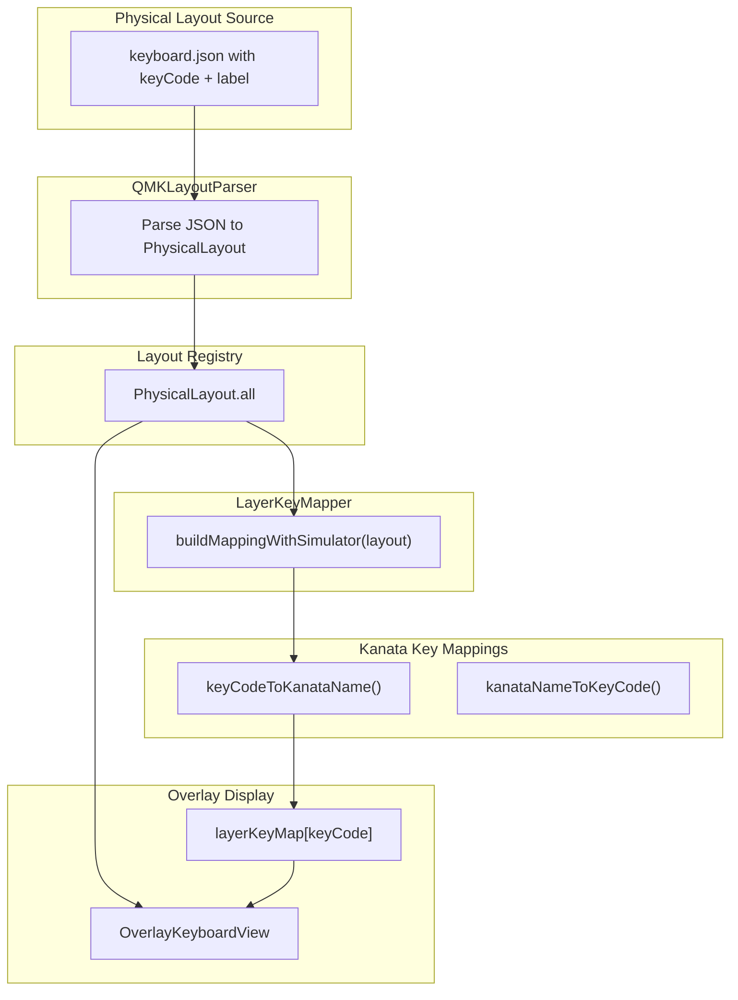

# Multi-Keyboard Overlay Architecture

## Overview

KeyPath's keyboard overlay visualization supports multiple physical keyboard layouts through a unified architecture based on macOS keyCodes as the universal identity. This document describes the design tenets, data flow, and implementation details for multi-keyboard support.

## Core Architectural Principle: keyCode as Universal Identity

All key-related data flows through macOS keyCodes (`UInt16`). This design choice enables:

- **Universal compatibility**: Any keyboard that emits standard macOS keyCodes works automatically
- **Runtime flexibility**: Layer mappings are built dynamically from Kanata's actual behavior
- **Semantic rendering**: Visual styling (SF Symbols, icons, emphasis) applies universally across keyboards

### Data Flow Architecture



## Tiered Keyboard Support Model

KeyPath uses a three-tier model for keyboard support, balancing polish with scalability:

| Tier | Description | Key Mapping Source | Customization | Examples |
|------|-------------|-------------------|---------------|----------|
| **Tier 1** | Hand-tuned, polished | JSON + optional Swift overrides | Full Swift customization | MacBook, Kinesis 360 |
| **Tier 2** | Curated, minimal tuning | JSON with semantic key registry | JSON-based overrides | Standard TKL, 60%, 65% |
| **Tier 3** | Auto-imported | QMK JSON + ANSI position table | Community contributions | Community keyboards |

### Tier 1: Hand-Tuned Keyboards

Tier 1 keyboards receive the highest level of polish:
- Physical layout defined in JSON (QMK format)
- Key mappings (keyCode + label) stored in JSON
- Optional Swift overrides for custom behavior (e.g., MacBook Touch ID, Kinesis layer keys)
- Full semantic rendering support

**Example**: Kinesis Advantage 360
- Physical layout: `adv360pro.json` (QMK format)
- Key mappings: Embedded in JSON with `keyCode` and `label` fields
- Custom handling: `0xFFFF` sentinel keyCode for keys without macOS equivalents (Layer, Fn)

### Tier 2: Curated Keyboards

Tier 2 keyboards use standard layouts with minimal customization:
- Physical layout from QMK JSON
- Key mappings auto-generated from ANSI position table
- Semantic key registry applies standard styling
- JSON-based overrides for special keys

### Tier 3: Auto-Imported Keyboards

Tier 3 keyboards are community-contributed:
- Physical layout from QMK JSON
- Key mappings auto-generated from ANSI position table
- Basic rendering (no custom styling)
- User-contributed improvements can promote to Tier 2

## Semantic Rendering

All tiers benefit from KeyPath's semantic key registry, which provides:

- **SF Symbols** for standard Apple keys (Command ⌘, Option ⌥, Control ⌃, Shift ⇧)
- **Community conventions** (Hyper ✦, Meh)
- **App icons** for launch actions (resolved via NSWorkspace)
- **LED indicators** (Caps Lock state)
- **Custom icons** via push-msg (see ADR-024)

This semantic layer sits above the physical layout, ensuring consistent visual language across all keyboards.

## Data Flow



### Step-by-Step Flow

1. **Layout Loading**: `QMKLayoutParser` reads JSON file, extracts physical positions (x, y, w, h, r) and key mappings (keyCode, label)
2. **Layout Registry**: `PhysicalLayout.all` maintains list of available layouts
3. **User Selection**: UI selects layout via `@AppStorage("overlayLayoutId")`
4. **Layer Mapping**: `LayerKeyMapper.buildMappingWithSimulator()` uses the selected layout's keys to query Kanata simulator
5. **Key Identity Resolution**: Each key's `keyCode` is converted to Kanata name via `keyCodeToKanataName()`
6. **Simulation**: Kanata simulator returns what each key outputs in the current layer
7. **Display**: `OverlayKeyboardView` renders keys using `layerKeyMap[keyCode]` for labels and behavior

## JSON Format Specification

### Extended QMK Format

KeyPath extends the standard QMK `info.json` format with `keyCode` and `label` fields:

```json
{
  "id": "adv360pro",
  "name": "Kinesis Advantage360",
  "layouts": {
    "default_transform": {
      "layout": [
        {
          "row": 0,
          "col": 0,
          "x": 0,
          "y": 0.25,
          "w": 1.25,
          "keyCode": 24,
          "label": "="
        },
        {
          "row": 0,
          "col": 1,
          "x": 1.25,
          "y": 0.25,
          "keyCode": 18,
          "label": "1"
        }
      ]
    }
  }
}
```

### Field Descriptions

| Field | Type | Required | Description |
|-------|------|----------|-------------|
| `row` | Integer | Yes | Matrix row position |
| `col` | Integer | Yes | Matrix column position |
| `x` | Double | Yes | Physical X position (keyboard units) |
| `y` | Double | Yes | Physical Y position (keyboard units) |
| `w` | Double | No | Key width (default: 1.0) |
| `h` | Double | No | Key height (default: 1.0) |
| `r` | Double | No | Rotation in degrees (default: 0.0) |
| `rx` | Double | No | Rotation pivot X (default: key center) |
| `ry` | Double | No | Rotation pivot Y (default: key center) |
| `keyCode` | Integer | Yes* | macOS CGEvent key code (UInt16) |
| `label` | String | Yes* | Display label for the key |

\* Required for Tier 1 keyboards. Tier 2/3 keyboards can omit these and use ANSI position table fallback.

### Sentinel keyCode: 0xFFFF

Keys without macOS equivalents (e.g., Kinesis Layer key, Fn keys) use `0xFFFF` as a sentinel value. These keys:
- Are filtered out of layer mapping queries (no Kanata simulation)
- Display their `label` directly
- Can have custom Swift handling for special behavior

## KeyCode Coverage

KeyPath maintains bidirectional mappings between macOS keyCodes and Kanata key names:

- **`keyCodeToKanataName()`**: Maps keyCode → Kanata name (e.g., `115` → `"home"`)
- **`kanataNameToKeyCode()`**: Maps Kanata name → keyCode (e.g., `"home"` → `115`)

### Current Coverage

- **Standard keys**: All letters, numbers, punctuation (60+ keys)
- **Modifiers**: All macOS modifiers (Command, Option, Control, Shift, fn)
- **Function keys**: F1-F12
- **Navigation**: Arrow keys, Home, End, Page Up/Down
- **Extended F-keys**: F13-F19 (for keyboards with extra function keys)

### Missing Coverage

If a keyCode is not in the mapping, it returns `"unknown-{keyCode}"` and is filtered out of layer mapping queries. To add support:

1. Add to `OverlayKeyboardView.keyCodeToKanataName()` (forward mapping)
2. Add to `KeyboardVisualizationViewModel.kanataNameToKeyCode()` (reverse mapping)
3. Verify Kanata recognizes the key name

## Adding a New Keyboard

### Tier 1 Keyboard (Hand-Tuned)

1. **Create JSON file**: `Sources/KeyPathAppKit/Resources/Keyboards/{keyboard-id}.json`
   - Include physical layout (x, y, w, h, r)
   - Include `keyCode` and `label` for each key
   - Use `0xFFFF` for keys without macOS equivalents

2. **Add to registry**: Update `PhysicalLayout.all` in `PhysicalLayout.swift`:
   ```swift
   static let all: [PhysicalLayout] = [
       macBookUS,
       kinesisAdvantage360,
       yourNewKeyboard  // Add here
   ]
   ```

3. **Optional Swift overrides**: Create custom handling in Swift if needed (e.g., special key behavior)

### Tier 2 Keyboard (Curated)

1. **Create JSON file**: Physical layout only (no keyCode/label)
2. **Add ANSI position mapping**: Extend ANSI position table if keyboard uses non-standard layout
3. **Add to registry**: Same as Tier 1
4. **Test**: Verify semantic rendering works correctly

### Tier 3 Keyboard (Auto-Import)

1. **User imports QMK JSON**: Via UI (future feature)
2. **Auto-generate mappings**: Use ANSI position table
3. **Basic rendering**: No custom styling
4. **Community contribution**: Users can submit improvements

## Implementation Details

### LayerKeyMapper Architecture

`LayerKeyMapper` builds layer mappings by:
1. Taking a `PhysicalLayout` parameter (not hardcoded to MacBook)
2. Iterating over layout's keys
3. Converting each keyCode to Kanata name
4. Querying Kanata simulator for that key's output in the current layer
5. Building `[UInt16: LayerKeyInfo]` dictionary keyed by keyCode

This design ensures:
- **Layout-agnostic**: Works with any keyboard layout
- **Runtime accurate**: Uses Kanata's actual behavior, not config parsing
- **Cached**: Mappings are cached per layer for performance

### ConfigurationService Note

`ConfigurationService` uses `PhysicalLayout.macBookUS` for config generation (line 538). This is intentional:
- Kanata runs on macOS regardless of visualization keyboard
- Config generation needs a canonical key set
- Visualization keyboard is independent of runtime keyboard

## Related Documentation

- [KEYBOARD_VISUALIZATION_MVP_PLAN.md](KEYBOARD_VISUALIZATION_MVP_PLAN.md) - Original MVP design (MacBook-focused)
- [ADR-023](CLAUDE.md#adr-023-no-config-file-parsing---use-tcp-and-simulator) - No config parsing, use TCP and simulator
- [ADR-024](CLAUDE.md#adr-024-custom-key-icons-and-emphasis-via-push-msg) - Custom icons and emphasis via push-msg
- [ADR-025](CLAUDE.md#adr-025-configuration-management---one-way-write-with-segmented-ownership) - Config management architecture
