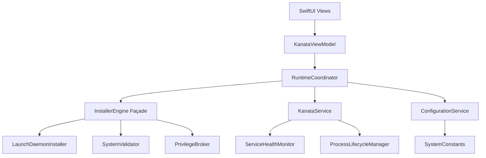

# KanataManager Refactoring Plan

This document outlines the step-by-step plan to decompose the `KanataManager` monolith into maintainable, single-responsibility services. The goal is to improve clarity, testability, and flexibility without over-engineering.

## Phase 1: Cleanup & Centralization
**Goal:** Reduce visual noise and eliminate "magic strings" to make the actual logic visible.

### 1. Legacy Code Excision
*   **Action:** Aggressively delete all code blocks labeled `// Legacy removed`, `// Removed:`, or `// Deprecated` in `KanataManager.swift` and its extensions.
*   **Why:** These comments add massive cognitive load and hide the active logic. Git history is the backup.

### 2. Centralize System Paths
*   **Action:** Create `SystemConstants.swift` in `KeyPathCore`.
*   **Content:** Define static constants for all hardcoded paths:
    *   Config directory: `~/.config/keypath`
    *   Config filename: `keypath.kbd`
    *   Log paths: `/var/log/com.keypath.kanata.stderr.log`
    *   Daemon support paths: `/Library/Application Support/...`
    *   TCC database paths.
*   **Implementation:** Replace all string literals in `KanataManager`, `InstallerEngine`, and `KanataManager+Configuration`.

---

## Phase 2: AI & Configuration Abstraction
**Goal:** Decouple "Intelligence" from "Runtime Management" and make models swappable.

### 3. Extract AI Service Layer
*   **Action:** Define protocol `AIConfigRepairService`.
    *   **Input:** `(brokenConfig: String, errors: [String], intendedMappings: [KeyMapping])`
    *   **Output:** `String` (Fixed Config)
*   **Implementation:**
    *   Create `AnthropicRepairService` implementing this protocol (move logic from `KanataManager.callClaudeAPI`).
    *   Allows future addition of `OllamaRepairService` or `OpenAIRepairService`.
*   **Integration:** Inject into `ConfigurationService`. `KanataManager` delegates repair requests to `ConfigurationService`, which calls the AI.

### 4. Consolidate Configuration Logic
*   **Action:** Move all "file manipulation" logic out of `KanataManager`.
*   **Move:**
    *   `backupCurrentConfig`
    *   `restoreLastGoodConfig`
    *   `saveGeneratedConfiguration`
    *   `handleInvalidStartupConfig`
*   **Destination:** `ConfigurationService` (or new `ConfigLifecycleManager`).
*   **Result:** `KanataManager` becomes a coordinator that requests saves but doesn't handle file I/O.

---

## Phase 3: UI State Separation (MVVM Cleanup)
**Goal:** Stop `KanataManager` from managing View state.

### 5. Extract UI Notification State
*   **Action:** Identify UI-only properties in `KanataManager`:
    *   `showingValidationAlert`
    *   `validationAlertTitle`
    *   `saveStatus`
    *   Direct `SoundManager` calls
*   **Refactor:** Move this state into `KanataViewModel` or a dedicated `AppState` observable.
*   **Pattern:** `KanataManager` emits events (e.g., `.validationFailed(error)`). The `ViewModel` listens and decides to show an alert or play a sound.

---

## Phase 4: The Final Split (Service Architecture)
**Goal:** `KanataManager` becomes a thin coordinator.

> **Progress (Nov 24, 2025):** 
> 
> ✅ **Façade Migration Complete:**
> - Health/TCP monitoring consolidated inside `KanataService`
> - `RuntimeCoordinator` consumes the façade instead of `ServiceHealthMonitor` directly
> - All wizard flows (Kanata Service page, Components page, Reset Everything, etc.) use façade
> - CLI commands (`keypath-cli repair`) route through `InstallerEngine`
> - Settings Status tab, uninstall dialog, wizard state detector use façade
> 
> ✅ **Health Check APIs Exposed (Nov 24, 2025):**
> - `InstallerEngine.getServiceStatus()` - aggregated service status
> - `InstallerEngine.isServiceHealthy(serviceID:)` - per-service health check
> - `InstallerEngine.isServiceLoaded(serviceID:)` - per-service load check
> - `InstallerEngine.checkKanataServiceHealth(tcpPort:)` - Kanata running + TCP responsive
> - Callers (`MainAppStateController`, `ConfigurationService`, `WizardAutoFixer`) migrated to façade
> 
> ✅ **Types Made Public:**
> - `LaunchDaemonStatus` - service status snapshot
> - `KanataHealthSnapshot` - Kanata health snapshot
> - `KanataServiceHealth` - internal health type
> 
> **Remaining Work:**
> 1. Update legacy helper documentation to describe façade-first approach
> 2. Continue slimming `LaunchDaemonInstaller` as more logic moves to façade

### 6. Split into Functional Services
Decompose the remaining logic into injected services:
- [x] **`ProcessCoordinator`**: Handles start/stop/restart logic (delegating to `InstallerEngine`). _Status:_ `ProcessCoordinator` now wraps `KanataService` for start/stop/restart (with installer fallback). Wizard flows now reuse the façade. Remaining direct callers have been migrated.
- [x] **`HealthMonitor`**: Ensure it owns *all* health logic. _Status:_ `KanataService` now owns `ServiceHealthMonitor`, and callers (RuntimeCoordinator, DiagnosticsManager, TCP reloads) invoke façade helpers instead of keeping their own monitors.
- [x] **`DiagnosticService`**: Ensure it owns *all* log parsing (remove `analyzeLogContent` from Manager). _Status:_ `DiagnosticsService` now performs log parsing and real-time VirtualHID monitoring; RuntimeCoordinator simply forwards events.

### 7. Rename to `RuntimeCoordinator`
- [x] **Action:** Rename `KanataManager` to `RuntimeCoordinator`.
- [x] **Responsibility:** It simply listens to events from the services above and updates the UI stream. (UI state now flows through `KanataViewModel`; remaining service wiring is being migrated.)

## Proposed Architecture Diagram

## Summary

The strangler fig refactor is **substantially complete**. The façade (`InstallerEngine`) now provides:

1. **System Inspection:** `inspectSystem()` returns a `SystemContext` snapshot
2. **Repair/Install:** `run(intent:using:)` chains inspect → plan → execute
3. **Health Checks:** `getServiceStatus()`, `isServiceHealthy()`, `checkKanataServiceHealth()`
4. **Single Actions:** `runSingleAction(_:using:)` for targeted repairs

All major callers have been migrated to use the façade. The remaining work is documentation updates and continued cleanup of legacy code paths.
